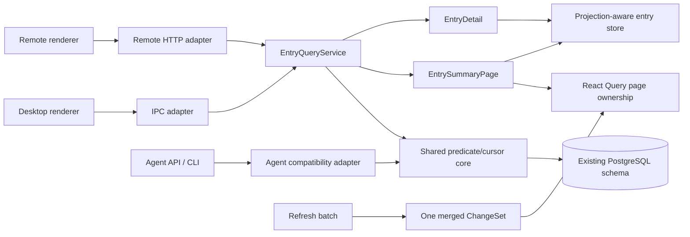

# Suhui Desktop 与 Remote 性能重构设计文档

> 本文是 `.loopx/intake/2026-07-13-desktop-performance-refactor/` 的详细设计。方向约束来自同目录下的 [设计提案](./设计提案.md)，本文不重新讨论换栈或数据库改造。

## 一、修订历史

| 版本号 | 修订内容                                                             | 修订时间   | 修订人     |
| ------ | -------------------------------------------------------------------- | ---------- | ---------- |
| V1.0.0 | 首版：统一 Desktop/Remote 查询、启动、刷新、侧栏、依赖和打包性能合同 | 2026-07-13 | Suhui Team |

## 二、需求信息

### 2.1 需求背景

- 背景：生产 renderer 的 `shell_ready_ms` 诊断值约 2051ms；条目列表、关键 hydration 和刷新同步均存在随数据量放大的无界路径。
- 需求目的：在不改数据库层设计和基础技术栈的前提下，消除页面加载和视图切换中的主要卡顿。
- 目标用户/使用方：Electron Desktop 用户，以及由运行中 Desktop 托管的 LAN/VPN Remote 浏览器用户。
- Intake package：`.loopx/intake/2026-07-13-desktop-performance-refactor/`。
- Canonical requirement contract：`.loopx/intake/2026-07-13-desktop-performance-refactor/requirements.md`，其中 `AC-1` 至 `AC-9`、`TC-1` 至 `TC-7` 为验收真相源。
- Supporting evidence：`.loopx/intake/2026-07-13-desktop-performance-refactor/clarification.md`，用于保留用户“不动数据库设计”和 Desktop/Remote 同一计划等原始决策。
- 代码证据：`packages/internal/store/src/runtime/client.ts`、`packages/internal/database/src/services/entry.ts`、`apps/desktop/layer/main/src/ipc/services/db.ts`、`apps/desktop/layer/renderer/src/remote/main.tsx`。

### 2.2 需求范围

- 本期范围：共享条目查询、摘要/详情分离、真实 cursor 分页、Desktop 有界 hydration、刷新失效合并、Remote 提前挂载、订阅侧栏优化、启动依赖拆分、性能基准、RSSHub artifact 排除。
- 非目标：数据库 engine/schema/index/migration/config precedence、Remote 权限、RSS 业务功能、Electron/React/Drizzle/router/state library 替换、全仓依赖清理。
- 决策边界：仅改变应用层查询形态、传输边界、内存状态和加载时机；持久化数据与现有外部 URI/method 保持兼容。
- 依赖方：PostgreSQL、Electron main IPC、Remote HTTP/SSE、React Query、renderer normalized store、Electron Forge。
- 约束：每个实施提交须可独立验证和回滚；不得修改或覆盖用户已有 `.gitignore`、`.vscode/settings.json` 变更。
- Support lenses：`api-designer`、`architecture-designer`、`sql-style`。

### 2.3 可行性分析

- 业务可行性：列表只需要摘要；仓库已有详情补拉路径，Remote 提前显示 shell 也已得到用户确认。
- 技术可行性：`apps/desktop/layer/main/src/application/agent/service.ts` 已实现三字段 keyset、投影和限制，可抽取共享核心。
- 团队接受能力：沿用现有 TypeScript、Drizzle、IPC、HTTP 和 React Query，不引入新语言或运行时。
- 时间成本：属于跨 main/store/renderer/build 的中大型重构，应按兼容门禁分段实施；本文不承诺日历时间。
- 资源成本：需要可复现的两套 fixture、production build 性能采样和 artifact 检查；不增加线上服务成本。
- 替代方案：换栈、换库、仅加索引、仅虚拟化、Desktop/Remote 两套分页均已在设计提案中拒绝。
- 关键风险：现有列表可能隐含依赖正文字段；旧 Remote 外部调用方可能依赖无参数全量响应；无 schema/index 改动下 stress fixture 可能仍暴露 SQL 计划瓶颈。

## 三、概要设计

### 3.1 方案总述

- 设计目标：让首屏和列表请求成本受页大小约束，而不是受全库条目数和正文体积约束。
- 总体思路：Electron main application 层统一查询语义；Desktop/Remote 仅做 transport adaptation；renderer 以 query page 管理成员关系，以 normalized store 管理单条摘要/详情。
- 核心模块：`EntryQueryService`、Desktop IPC adapter、Remote HTTP adapter、entry projection-aware store、startup coordinator、refresh ChangeSet、Remote bootstrap、sidebar rendering boundary、performance harness。
- 主要难点：旧接口兼容、同时间戳稳定分页、summary 晚到不覆盖 detail、启动期用户写入冲突、批量刷新失效去重、侧栏虚拟化与拖拽兼容。
- 技术指标：全部采用 requirements 中已确认的 P95 门槛；不另造 SLO。

### 3.2 整体架构设计



- 业务模式：Desktop main 继续作为唯一 DB 访问和写入协调者；Remote 仍是 Desktop 托管客户端。
- 系统边界：不新增服务、进程、数据库或远程数据面。
- 数据所有权：PostgreSQL 是持久化真相；React Query/store/snapshot 都是可重建缓存。
- 一致性：列表翻页采用 keyset 的读已提交语义，不提供跨页快照隔离；刷新事件触发当前视图校准。
- 数据流：DB 先过滤/排序/投影/limit，再通过 IPC/HTTP 传摘要；正文仅通过 detail path。

### 3.3 核心流程设计

| 流程             | 触发条件               | 参与模块                                 | 主流程                                                   | 异常/补偿                                        | 输出                         |
| ---------------- | ---------------------- | ---------------------------------------- | -------------------------------------------------------- | ------------------------------------------------ | ---------------------------- |
| Desktop 首次显示 | 应用启动               | snapshot、readiness、EntryQueryService   | shell -> snapshot -> DB usable -> 当前 route 首摘要页    | snapshot/列表失败显示可重试状态，不全量 fallback | 可交互当前列表               |
| 列表翻页         | 滚动到页尾             | React Query、adapter、EntryQueryService  | opaque cursor -> `limit+1` -> page merge                 | 非法 cursor 丢弃缓存并从第一页恢复               | 稳定下一页                   |
| 打开详情         | 选中条目               | normalized store、detail query           | 检查 explicit detail state -> 按 ID 补拉 -> merge detail | not found 显示现有不可用状态                     | 完整正文                     |
| 批量刷新         | 手动/启动/定时刷新结束 | refresh service、IPC/SSE、query client   | 写库 -> 单次 ChangeSet -> 相交 query stale/refetch       | 部分失败只通知成功 feed，错误继续审计            | 最新活动视图                 |
| Remote 首屏      | 浏览器打开             | HTML、React root、bootstrap、entry query | 先 mount shell -> metadata bootstrap -> 首摘要页 -> SSE  | bootstrap/entries 各自显示 retry；shell 不卸载   | loading/error/ready 明确状态 |
| 侧栏渲染         | 订阅/未读/排序变化     | selector、sort model、list renderer      | 稳定派生 -> 可见节点渲染 -> 保持交互                     | 虚拟化不兼容时退回 memo/selector 优化            | 等价侧栏行为                 |
| artifact 生成    | Forge package/make     | ignore rules、artifact assertion         | 排除废弃 RSSHub -> 校验必需资源                          | 守卫失败则构建失败                               | 精简 artifact                |

### 3.4 功能模块

| 模块                         | 职责                  | 关键功能                                           | 依赖                          | 备注                        |
| ---------------------------- | --------------------- | -------------------------------------------------- | ----------------------------- | --------------------------- |
| EntryQueryService            | 唯一列表/详情读取语义 | scope、read filter、visibility、cursor、projection | Drizzle/PostgreSQL            | 不拥有 transport envelope   |
| IPC/HTTP adapters            | 参数与错误映射        | 保留现有表面、添加分页                             | EntryQueryService             | 不允许 JS 后过滤/切片       |
| Entry page/store             | page 成员与实体合并   | summary/detail completeness、optimistic read       | React Query/store             | 不把 store 视为 DB 全集     |
| Startup coordinator          | Desktop 有界启动      | snapshot、route page、readiness metrics            | DB status/store               | 正文不进 critical hydration |
| Refresh ChangeSet            | 合并失效              | batch id、feed scope、一次通知                     | IPC/SSE/query cache           | DB 仍为真相源               |
| Remote bootstrap             | 先 shell 后数据       | loading/error/retry/ready                          | `/api/bootstrap`、entries API | SSE 不阻塞首次数据 ready    |
| Sidebar boundary             | 大订阅量 UI           | memo selector、按需/虚拟渲染                       | subscription/unread stores    | 行为优先于虚拟化            |
| Startup graph                | 关键 bundle 控制      | lazy feature/provider、bundle budget               | Vite                          | 只处理有测量影响的依赖      |
| Performance/artifact harness | 门禁                  | fixtures、P95、payload、artifact path              | production build/Forge        | 失败不静默放宽阈值          |

### 3.5 新增/调整功能说明

- Desktop：列表由 page API 驱动，启动 entry hydration 改为最多 100 条摘要窗口，深链详情独立补拉。
- Remote：首个 React commit 前不发 bootstrap 请求；条目 list response 增加 `page` metadata，现有 routes 保留。
- 刷新：批次完成后发布一次 ChangeSet，非活动查询只 stale，不逐 feed 灌入整个 store。
- 侧栏：只做行为等价的计算/渲染优化。
- 构建：启动图按实测拆分；Forge 明确忽略 `resources/rsshub` 并检查 artifact。

### 3.6 专项设计检查

| 辅助 skill              | 触发原因                            | 检查内容                                               | 设计结论                                                           |
| ----------------------- | ----------------------------------- | ------------------------------------------------------ | ------------------------------------------------------------------ |
| `api-designer`          | REST/IPC、cursor、兼容              | resource shape、bounded collection、errors、versioning | URI/method 和 `data` 保持；paged response additive `page`；不建 v2 |
| `architecture-designer` | 跨端共享边界和 NFR                  | ownership、failure、rollback、operability              | main 持有查询；不引入新部署单元；缓存均可重建                      |
| `sql-style`             | PostgreSQL keyset/query performance | projection、deterministic order、NULL、EXPLAIN         | 时间字段现为 non-null；禁止 `SELECT *`；不改 schema/index          |

## 四、详细设计

### 4.1 共享条目查询与分页

#### 4.1.1 需求内容

- 入口：Desktop `runtimeClient.entries.list`、Remote `GET /api/entries`、agent compatibility adapter。
- 调用方：renderer query hooks 和 Remote fallback shell。
- 前置条件：main DB usable；scope 可规范化。
- 输出结果：`EntrySummaryPage` 或 `EntryDetail | null`。

#### 4.1.2 方案设计

**Interface Contract - `D-001`（来源：`AC-1`、`AC-2`）**

- 决策：新增唯一 application-layer `EntryQueryService`；Desktop IPC 与 Remote HTTP 必须调用它，禁止 adapter/renderer 自行实现过滤、排序或切片。
- 边界：agent API 保持外部 DTO，可复用 predicate/cursor core；不强制其改成普通 Remote envelope。
- 下游要求：`plan-to-exec` 必须先固定 service characterization，再迁移 transport；review 必须搜索并阻止生产路径继续调用无界 `getEntries`。

```ts
type EntryListScope =
  | { kind: "timeline"; view?: number; excludePrivate?: boolean }
  | { kind: "feeds"; feedIds: string[] }
  | { kind: "list"; listId: string }
  | { kind: "inbox"; inboxId: string }
  | { kind: "collection"; view?: number }

type EntryListQuery = {
  scope: EntryListScope
  read?: boolean
  limit?: number
  cursor?: string
}

type EntrySummaryPage = {
  items: EntrySummary[]
  page: { limit: number; hasMore: boolean; nextCursor: string | null }
}

type DetailVisibilityPolicy = "desktop-non-deleted" | "active-relations"

interface EntryQueryService {
  list(query: EntryListQuery): Promise<EntrySummaryPage>
  getDetail(entryId: string, policy: DetailVisibilityPolicy): Promise<EntryDetail | null>
}
```

规范化规则：每个请求只能有一个 scope；`feedIds` trim、去空、去重；空数组返回空页，绝不退化为 All；read 缺失表示全部；`read=false` 使用 `read IS NOT TRUE` 或等价 SQL，使历史 `NULL` 保持未读，summary 一律规范化成 boolean；visibility 与 list/inbox/collection 关系过滤尽量进入 SQL，不允许先读全表再在 JS 过滤。

**Data Contract - `D-002`（来源：`AC-1`、`AC-2`）**

- 决策：固定 `publishedAt DESC, insertedAt DESC, id DESC`，cursor 为 base64url 编码的版本化 JSON `{v:1,publishedAt,insertedAt,id}`。下一页使用严格字典序 `<`，默认 limit 20，只接受 1..100，超范围、非整数或非数字返回参数错误；查询 `limit+1` 行推导 `hasMore`，不执行 count。
- 边界：不提供跨页 snapshot isolation；filter/scope 变化后 cursor 作废；cursor 不持久化到 DB。
- 下游要求：覆盖相同时间戳、空页、末页、并发插入和非法 cursor；生成 SQL 必须有投影与 limit。

**Data/Behavior Contract - `D-003`（来源：`AC-1`、`AC-2`、`AC-3`）**

- 决策：分页列表返回 `recordKind="summary"` 的 allowlist，禁止包含 `content`、`readabilityContent`、`readabilityUpdatedAt`。详情返回 `recordKind="detail"` 和现有完整字段。
- Summary allowlist：`id,title,url,description,guid,author,authorUrl,authorAvatar,insertedAt,publishedAt,media,categories,attachments,language,feedId,inboxHandle,read,sources`。
- Video 等特殊列表视图优先使用 summary 中的 `url/attachments/media/description`。只有当用户悬停、激活或打开预览，且这些字段不足以确定内嵌媒体时，才通过 detail path 获取该条正文并在客户端派生视频 URL；补拉不阻塞列表 usable 判定，并受可见项与并发上限约束。
- detail visibility 由 transport 传入显式 policy：Desktop IPC 使用 `desktop-non-deleted`，保留 pending/unsubscribed/deep-link 条目；Remote HTTP、Remote PDF 与 agent 使用 `active-relations`。共享 service 统一读取/投影，但不得把 Remote 限制反向施加到 Desktop。
- 边界：`extra/settings` 只有 characterization 证明列表首屏真实使用时才能加入 allowlist；不能以兼容为由退回完整 row。
- 下游要求：测试 DTO 和实际 SQL 都不选择两类正文；详情为空正文也必须显式标记为 detail-loaded。

#### 4.1.3 流程步骤

1. adapter 将旧参数转换成唯一 `EntryListScope`，规范化 read/limit/cursor。
2. list service 加 active visibility、deleted filter、scope 和 keyset predicate。
3. DB 按三字段排序，只投影 summary allowlist，读取 `limit+1`。
4. service 截为 limit，生成 `hasMore/nextCursor`。
5. renderer 以 page 保存顺序，以 store 按 ID 合并摘要。
6. 选中条目时，若 explicit detail state 未加载，则调用 detail query。

#### 4.1.4 边界条件

| 场景                                | 处理方式                          | 用户/调用方感知            | 监控/告警             |
| ----------------------------------- | --------------------------------- | -------------------------- | --------------------- |
| 冲突 scope                          | `SUHUI_INVALID_ENTRY_SCOPE`       | HTTP 400 / IPC typed error | invalid counter       |
| 空 feedIds                          | 空 page                           | 正常空状态                 | rows=0                |
| 重复 feedIds                        | 服务端去重                        | 无差异                     | normalized scope size |
| 无效 limit/cursor                   | 稳定 400/typed error              | 当前列表可重试             | error code            |
| 同时间戳                            | 用 insertedAt/id 决胜             | 无重复遗漏                 | pagination test       |
| 翻页中插入/删除                     | keyset 继续旧方向；事件后首屏校准 | 允许新内容提示，不跳页     | refetch reason        |
| Desktop pending/unsubscribed detail | 非 deleted 即可返回               | 深链/历史选择保持可读      | detail policy         |
| Remote/agent 不可见或任何表面已删除 | detail 返回 null                  | 现有 unavailable 状态      | not-found count       |
| DB timeout                          | 明确失败，不跑全量 fallback       | 错误与重试                 | duration/error        |

#### 4.1.5 不变行为

| 行为/表面                      | 保持原因                              | 验证方式                     |
| ------------------------------ | ------------------------------------- | ---------------------------- |
| list active visibility         | 防止已删除/隐藏来源进入列表           | Desktop/HTTP parity test     |
| 各表面 detail visibility       | 保留 Desktop 深链且不扩大 Remote 暴露 | policy-specific detail tests |
| read/unread、All、多 feed 语义 | 核心阅读行为                          | `TC-2`                       |
| 详情内容优先级与 PDF 路径      | 用户可见内容不变                      | detail/PDF regression        |
| `/api/agent/entries` 和 CLI    | 外部兼容                              | agent service tests          |

### 4.2 Transport 与 renderer 所有权

#### 4.2.1 需求内容

- 入口：`db.listEntries` IPC、`GET /api/entries`、entry query/store merge。
- 输出：transport-specific envelope，但规范化后的 items/page 语义相同。

#### 4.2.2 方案设计

**Interface/Compatibility Contract - `D-004`（来源：`AC-2`）**

- Desktop 新 IPC：`db.listEntries(query) -> EntrySummaryPage`；`db.getEntry(id)` 由共享 service 的 `desktop-non-deleted` policy 提供。Remote detail/PDF 与 agent 使用 `active-relations`。
- 旧 `db.getEntries(feedId?)` 保留为 deprecated、最多 100 条 summary 的 wrapper，所有仓库内生产调用迁移后不得再使用。
- HTTP 保留 `GET /api/entries`、`GET /api/entries/:id`、现有 method 和 `{data}`；所有 list response 都新增顶层 `page`。
- HTTP 不提供无界 legacy 分支；没有 `limit` 时默认 20，仍返回 summary page。Suhui Remote/fallback shell 必须消费 `page.nextCursor`。
- 参数错误为 `{error:{code,message}}` 的 400；DB/内部错误为通用 500，不泄露 SQL、路径或正文。
- 边界：当前受支持调用方均随 Desktop 一起发布；若发现仓库外受支持调用方依赖全量正文或一次取完全集，返回 `spec` 决定 API 版本/迁移，不恢复无界默认值。
- 下游要求：同一 normalized query 的 IPC/HTTP items/page 必须一致；envelope 差异不参与语义比较。

**Behavior/State Contract - `D-005`（来源：`AC-1`、`AC-3`）**

- React Query page 数据拥有列表成员、顺序、`hasMore` 和 next cursor；normalized store 不再代表 DB 全集。
- `upsertSummaries` 不用缺失字段覆盖 detail；`upsertDetails` 显式设置 detail-loaded，即使正文合法为空。
- summary 晚于 detail 时保留正文；optimistic read 与 hydration dirty reconciliation 保留用户写入优先。
- 持久化 query cache 必须 bump contract buster，旧发布时间 cursor 页面不得恢复。
- 下游要求：覆盖 summary/detail 到达顺序、空正文、旧 cache、unread optimistic update 和自动前进。

#### 4.2.3 边界条件与不变行为

| 场景                | 处理                                                        | 不变行为                 |
| ------------------- | ----------------------------------------------------------- | ------------------------ |
| 老客户端只读 `data` | response 仍可解析但只有首个摘要页；仓库内调用方同步迁移分页 | route/method/`data` 不变 |
| summary 晚于 detail | merge 不清正文                                              | 阅读中内容不闪空         |
| detail 正文为空     | explicit loaded 防重复请求                                  | 空文章仍可展示元信息     |
| unread 标记已读     | optimistic 更新 query/store                                 | 当前自动前进行为不变     |
| 旧 cursor cache     | buster 丢弃并首屏重拉                                       | 不展示损坏页             |

### 4.3 Desktop 启动与有界 hydration

#### 4.3.1 需求内容

- 入口：production Desktop startup、snapshot restore、critical hydration。
- 输出：shell、DB 可用后交互态、当前路由首个摘要页。

#### 4.3.2 方案设计

**Behavior Contract - `D-006`（来源：`AC-3`、`AC-6`）**

- critical entry hydration 改为当前/恢复 route 的最多 100 条 summary；不得调用 `getEntriesToHydrate()` 读取全库完整条目。
- metadata 先提供解析 scope 所需的 feed/subscription/user/unread；snapshot 先显示，route query 再校准。
- `shell_ready` 与 `interactive` 不等待 metadata 或 entry hydration；`interactive` 继续严格定义为现有 `shellReady && dbUsable && snapshotRestoreSettled`，保持基线可比性。metadata/route/list 使用新增独立 ready 指标；entry page 失败只影响列表 pane。
- 深链 `entryId` 直接 detail query，不要求先出现在 startup window。
- snapshot 损坏/旧版本/未命中时请求首 page，不允许无界 fallback。
- 边界：现有 DB 连接/重试/config precedence 不在本轮改变。
- 下游要求：store 在 critical completion 时最多包含 100 startup summaries，加用户已打开的 detail/dirty entries；测试启动期间写入不被晚到 hydration 回滚。

#### 4.3.3 流程步骤

1. 记录 startup session，挂载 shell，恢复 snapshot。
2. 等待现有 DB usable 信号，同时并行准备不依赖 DB 的 UI。
3. shell、DB 和 snapshot settle 后按现有定义标记 interactive；不等待 metadata/list。
4. metadata 可用后标记 `route_scope_ready_ms`，解析当前 route 并请求最多 100 条 summary；首个成功/空 page 标记 `desktop_initial_entries_ready_ms`。
5. 非关键 store 并行 deferred hydrate；正文仅在用户打开详情时获取。

#### 4.3.4 边界条件与不变行为

| 场景                   | 处理                         | 用户感知/不变行为 |
| ---------------------- | ---------------------------- | ----------------- |
| snapshot hit           | 先显示摘要，再校准           | 现有快速恢复保留  |
| snapshot corrupt/miss  | loading/空 shell 后拉首 page | 不出现全量卡顿    |
| DB 暂不可用            | 沿用现有 DB 状态 UI          | 不改重试策略      |
| 深链不在窗口           | 独立 detail fetch            | 深链仍可打开      |
| hydration 中 mark read | dirty state 胜出             | 不回退已读状态    |

### 4.4 刷新通知与查询失效

#### 4.4.1 需求内容

- 入口：单 feed、手动批量、startup-auto、interval-auto 刷新。
- 输出：一次批次 ChangeSet 和受影响查询校准。

#### 4.4.2 方案设计

**Interface/Operational Contract - `D-007`（来源：`AC-4`、`AC-6`）**

```ts
type EntryChangeEventV1 = {
  version: 1
  batchId: string
  reason: "refresh" | "read" | "collection" | "subscription" | "import"
  source: string
  scope: "feeds" | "all"
  feedIds: string[]
  entryIds?: string[]
  refreshed?: number
  failed?: number
  completedAt: number
  feedId?: string
}
```

- 批量刷新 settle 后只发布一次；删除逐 feed 累计广播和 batch 结束重复广播。
- `feedIds` 只含成功且去重的 feed；0 个成功时不发 entries refresh event，但返回值/失败审计保留。
- Desktop 通道仍为 `local-feed-refresh-completed`；Remote SSE 仍为 `entries.updated`；单 feed 同时保留 `feedId`。
- mutation/refresh response 保留现有字段并 additive 返回同一个 `batchId`/ChangeSet。发起端可把 response 交给统一 invalidation coordinator 立即处理；稍后收到 transport event 时按 `batchId` 去重。response path 与 event path 不得各自触发一次 broad refetch。
- consumer 每个 batchId 最多处理一次；活动相交 query 每批最多 refetch 一次，非活动 query 仅 stale；unread 合并失效一次，普通 refresh 不额外刷新 collections。
- SSE 重连后全局 entries stale 一次并刷新 bootstrap metadata，补偿断线丢事件。
- mutation 统一进入以下失效矩阵；现有 `subscriptions.updated` 等 event name 保留，renderer 先归一化 reason 再执行矩阵，不能把所有 mutation 当 refresh：

| reason         | entries                                | unread       | collections                | subscriptions |
| -------------- | -------------------------------------- | ------------ | -------------------------- | ------------- |
| `refresh`      | 仅相交 scope stale，活动 query refetch | 一次 refetch | 不变                       | 不变          |
| `read`         | entryIds 对应 query optimistic/settle  | 一次 refetch | 不变                       | 不变          |
| `collection`   | collection scope stale                 | 不变         | 一次 refetch               | 不变          |
| `subscription` | 全部 entry scopes stale                | 一次 refetch | 一次 refetch，保留退订清理 | 一次 refetch  |
| `import`       | 全部 entry scopes stale                | 一次 refetch | 一次 refetch               | 一次 refetch  |

- 边界：事件不是数据真相或持久化日志；不承诺回放。
- 下游要求：`TC-4` 同时验证主进程事件数、batch 幂等和 renderer refetch 数。

#### 4.4.3 边界条件与不变行为

| 场景          | 处理                                        | 不变行为                   |
| ------------- | ------------------------------------------- | -------------------------- |
| 1/10/50 feed  | 每批一次 event；活跃 query 最多一次 refetch | 新条目最终可见             |
| 部分失败      | 只失效成功 feed，结果报告失败               | refresh 返回结构和日志保留 |
| 重复/快速事件 | batchId 去重/短窗口合并                     | 最终以 DB 校准             |
| SSE 断线      | 显示 disconnected，重连 stale               | 不伪装在线成功             |
| 事件乱序      | 不根据事件增量构造真相                      | 读状态/条目以查询结果为准  |

### 4.5 Remote 提前挂载与渐进数据

#### 4.5.1 需求内容

- 入口：Remote HTML/JS 首次加载、`/api/bootstrap`、初始 entries query、SSE。
- 输出：在网络请求完成前可见的 shell，以及明确 loading/error/ready 状态。

#### 4.5.2 方案设计

**Behavior/State Contract - `D-008`（来源：`AC-5`、`AC-7`）**

- React root、必要 providers 和 reader layout 必须在任何 bootstrap HTTP 请求前 mount；请求由 mount 后的 effect/query 发起。
- 状态为 `loading | ready | error`；loading 显示稳定布局骨架，不伪装为空数据；error 在 shell 内显示可重试状态，不能只写 console。
- metadata 使用现有 `GET /api/bootstrap` envelope；其内部查询可并发，但响应成功后原子写入 subscriptions/feed/unread/collections/settings/capabilities。未读计数必须使用现有 schema 上的 set-based SQL 聚合，只返回分组计数，不得把全部未读 entry rows 读入 JS 再聚合。
- 初始 entries 是独立 query：active scope 可确定后即可请求；失败只影响 timeline pane，不卸载 shell/sidebar。
- `remote_shell_visible_ms` 定义为 root 首次可见 commit；`remote_data_ready_ms` 只在 bootstrap 成功且初始 entries 首 page 成功或确定为空时记录。bootstrap/entries error visibility 单独记录，快速失败不得通过 data-ready 门槛。
- SSE connection 不阻塞 data ready，但断线必须继续显式显示。
- 边界：不改变 Remote auth/bind/permission；不把本轮描述成公网安全方案。
- 下游要求：用延迟/失败注入证明 shell 先于 bootstrap settle；移动/桌面 viewport 均无状态重排导致的布局覆盖。

#### 4.5.3 边界条件与不变行为

| 场景           | 处理                              | 用户感知/不变行为     |
| -------------- | --------------------------------- | --------------------- |
| bootstrap 延迟 | shell/loading 立即可见            | 页面不白屏            |
| bootstrap 失败 | shell 内 error/retry              | 已有静态 UI 不卸载    |
| entries 失败   | timeline pane retry               | sidebar/metadata 可用 |
| 无订阅         | bootstrap ready，entries 确定为空 | 现有空状态            |
| SSE 失败       | disconnected；阅读数据仍可浏览    | 连接状态诚实          |

### 4.6 订阅侧栏可扩展渲染

#### 4.6.1 需求内容

- 入口：400/800 subscriptions，未读变化、排序切换、分类展开、拖拽和键盘操作。
- 输出：可预测的计算与渲染成本，功能等价。

#### 4.6.2 方案设计

**Behavior/Performance Contract - `D-009`（来源：`AC-6`）**

- 先用稳定 selectors、memoized category/feed derived model、细粒度行订阅减少无关 re-render；只有 profiling 证明 DOM 数是主瓶颈时才引入分段/虚拟渲染。
- 必须保持未读/字母排序与升降序、选择、高亮、未读数字、分类展开、右键菜单、键盘导航、焦点恢复、拖拽命中和新增/编辑/删除同步。
- 虚拟化时固定行高/测量策略和 overscan，context menu/drag overlay 不依赖已卸载 DOM；焦点条目滚出窗口后可恢复。
- 若虚拟化不能通过拖拽和可访问性 characterization，则保留 DOM 结构，只交付 selector/memo 优化。
- 边界：不改变侧栏信息架构、排序规则或用户设置。
- 下游要求：800 subscriptions fixture 下采集 commit duration/render count，并跑现有 `SortedFeedItems`、timeline switch、unread count 和拖拽/键盘行为测试。

#### 4.6.3 边界条件与不变行为

| 场景            | 处理                          | 不变行为       |
| --------------- | ----------------------------- | -------------- |
| 未读批量变化    | 只重算相关 derived nodes      | 排序结果一致   |
| 收起大分类      | 不渲染不可见行                | 展开状态保留   |
| 拖拽跨 viewport | overlay/overscan 保持目标可达 | 拖拽语义不变   |
| 键盘焦点滚出    | scroll-to/focus restore       | 键盘导航不丢失 |
| 虚拟化行为失败  | 退回非虚拟 memo path          | 功能优先       |

### 4.7 启动依赖图与日志热路径

#### 4.7.1 需求内容

- 入口：Desktop/Remote production renderer bundles 和启动模块图。
- 输出：首屏只加载必要模块，调试日志不放大热路径。

#### 4.7.2 方案设计

**Architecture/Behavior Contract - `D-010`（来源：`AC-6`、`AC-7`）**

- 以 bundle analyzer 和 startup trace 为依据，将 settings、integration、discover、editor、Shiki、非首屏 command implementations、modal content 和非关键 providers 放到 route/feature dynamic import 边界。
- 命令 ID、基础快捷键和首屏真实调用能力可保留轻量 registry；执行实现按需加载，不能使快捷键首次使用失效。
- `parse-html` 等共享模块不得静态拉入完整 Shiki；代码高亮可先呈现普通 code block，再异步增强。
- Desktop 与 Remote 分别检查入口图；Remote 不得因复用组件静态引入 Desktop-only provider/command graph。
- 高频 `[startup-read-trace]` 等诊断输出必须由显式 debug flag 控制；稳定 `[startup]` metrics 和 refresh audit 保留。
- 边界：不做没有 bundle/startup 证据的全仓依赖删除。
- 下游要求：记录拆分前后 initial JS/shared JS/shared CSS、chunk 请求和 P95，不以 chunk 数减少代替用户指标。

#### 4.7.3 边界条件与不变行为

| 场景              | 处理                     | 不变行为                  |
| ----------------- | ------------------------ | ------------------------- |
| 首次打开设置/命令 | lazy chunk loading state | 功能可用且错误可重试      |
| Shiki 加载失败    | 保留未高亮 code block    | 文章内容不丢失            |
| debug flag 未开   | 不输出热路径 trace       | 稳定 startup metrics 保留 |
| Remote 入口       | 独立 dependency budget   | Remote 阅读能力不减少     |

### 4.8 打包、性能门禁与数据库停止条件

#### 4.8.1 需求内容

- 入口：production build、两套 fixture、Electron Forge package/make。
- 输出：P95 报告、artifact guard 和可执行停止条件。

#### 4.8.2 方案设计

**Operational Contract - `D-011`（来源：`AC-9`）**

- Forge ignore 必须匹配 `/resources/rsshub` 及其子路径；package/make 后扫描实际 app resources，断言不存在 `resources/rsshub`。
- 守卫同时断言 `resources/app-update.yml` 和必要 node modules/应用资源仍存在，避免过宽 ignore。
- 本地 ignored RSSHub 目录不作为 source fixture，也不得因目录不存在而让测试跳过。
- 边界：不删除用户本地目录；只控制打包输入/输出。
- 下游要求：unit test ignore predicate，artifact regression test 检查真实 staged/package tree。

**Operational/Performance Contract - `D-012`（来源：`AC-6`、`AC-7`、`AC-8`）**

- fixtures 固定为 normal `400 subscriptions / 10,000 entries`、stress `800 subscriptions / 100,000 entries`。
- fixture 使用固定 seed 与可审计 manifest：entries 尽量均匀分布到 subscriptions；view 分布为 Articles 60%、Social 20%、Pictures 10%、Videos 10%；各 5% subscription 标为 private/hideFromTimeline；read 分布为 `false` 60%、`true` 35%、legacy `NULL` 5%；至少 10% entries 共享 `publishedAt` 以覆盖 tie-breaker；正文大小分布 P50 8KiB、P95 64KiB、最大 256KiB，并包含 media/attachments/sources 样本。两规模只改变数量，不改变分布。
- Desktop cold：完全退出 production app，使用保留 fixture DB 但清除 snapshot/query cache 的 harness profile 启动；Desktop warm：同一 profile 完成一次成功 priming 后完全退出再启动，保留 snapshot/cache。Remote cold：新 browser context、禁用 HTTP cache访问已运行的 Desktop server；Remote warm：同一 server/profile 预热 assets 后重新导航，document/store 重新创建。
- 每个 fixture 都跑 production build 的 cold/warm 分组；每组至少 20 个成功有效样本，报告 P50/P95/max、机器/OS/arch、commit、build mode 和 fixture seed。P95 使用 nearest-rank：升序样本 `x[ceil(0.95*n)-1]`。
- 门槛：Desktop `shell_ready_ms <= 1200`；`interactive_ms - db_usable_ms <= 500`；feed/unread usable list `<= 300`；Remote shell `<= 800`；Remote data ready `<= 1500`，单位均为 ms、判定均为 P95。
- usable list 定义为首个非 skeleton row commit，或成功查询后确认的空状态 commit；error visibility 单独验证，不能把请求发出或失败时刻当完成。
- cold/warm 各自报告，任何一组 P95 超标即失败；样本不得通过删异常值达标，环境故障只能整组作废并说明。
- 边界：开发模式、单次手测和 stale 数据不能作为达标证据。
- 下游要求：性能 harness 必须可重复生成/清理 fixture，不污染用户数据库；报告和原始样本可审计。

**Operational Contract - `D-013`（来源：`AC-4`、`AC-6`、`AC-7`）**

- 保留现有 startup metrics 及其定义，并新增/派生：`db_usable_to_interactive_ms`、`route_scope_ready_ms`、`desktop_initial_entries_ready_ms`、`entry_query_duration_ms`、`entry_query_rows`、`entry_list_payload_bytes`、`desktop_startup_entry_rows`、`refresh_batch_event_count`、`refresh_renderer_refetch_count`、`remote_shell_visible_ms`、`remote_bootstrap_ready_ms`、`remote_initial_entries_ready_ms`、`remote_bootstrap_error_visible_ms`、`remote_entries_error_visible_ms`。
- 日志不得包含正文、标题、完整 URL query、SQL 参数、连接串或本机敏感路径；refresh 通过 `batchId` 关联 producer/event/refetch。
- 稳定指标在 production 可记录，详细 trace 受 debug/performance harness 开关控制。
- 下游要求：review 必须能从一次 run 区分 DB、serialization、transport、renderer commit 和 asset loading。

**Workflow/Decision Contract - `D-014`（来源：`AC-6`、`AC-7`、`AC-8`）**

- 本轮不得新增/修改 index、table、column、migration、DB engine 或 config precedence。
- 对 normal/stress fixture 记录代表性列表查询的生成 SQL 与 `EXPLAIN (ANALYZE, BUFFERS)`；EXPLAIN 缺失时只能报告证据缺口，不能宣称 DB 优化完成。
- 若 application refactor 完成后仍无法达到门槛，且证据表明必须改变 index/schema，执行立即停止并回到 `clarify/spec`；不得在 `plan-to-exec` 或实现阶段自行扩 scope。
- 边界：允许查询 projection、predicate、join/exists、keyset 和 batching 的应用层改写；不允许持久化设计变化。
- 下游要求：`plan-to-exec` 将此作为硬门禁，review/final-review 搜索 migrations/schema diff。

#### 4.8.3 边界条件与不变行为

| 场景                        | 处理                       | 结果         |
| --------------------------- | -------------------------- | ------------ |
| stress 超标且 query plan 差 | 保存证据，返回 spec        | 不加索引     |
| DB 无法运行 EXPLAIN         | 标记 unverified            | 不声称达标   |
| fixture run 环境故障        | 整组作废重跑               | 不挑样本     |
| RSSHub 目录本地不存在       | predicate/unit test 仍执行 | guard 不跳过 |
| ignore 误删必要资源         | artifact test 失败         | 阻止发布     |

## 五、存储类设计

### 5.1 库表设计

#### 5.1.1 数据库模型图

数据库实体关系完全不变。`subscriptions/feeds` 决定 active visibility，`entries.feed_id` 关联来源，`unread` 提供现有计数数据。本文不新增 FK、索引或表。

#### 5.1.2 表结构

| 表名            | 用途                   | 主键     | 关键索引          | 数据量预估               | 备注           |
| --------------- | ---------------------- | -------- | ----------------- | ------------------------ | -------------- |
| `entries`       | 条目摘要与正文         | `id`     | 仅沿用当前 schema | 10,000 / 100,000 fixture | 不改字段/index |
| `feeds`         | RSS 来源               | `id`     | 沿用当前 schema   | 与订阅同量级             | 不变           |
| `subscriptions` | active visibility/分类 | 现有主键 | 沿用当前 schema   | 400 / 800 fixture        | 不变           |
| `unread`        | 现有未读聚合记录       | 现有主键 | 沿用当前 schema   | 与来源相关               | 不变           |

字段明细：不涉及新增或修改字段。分页只读取既有 `published_at NOT NULL`、`inserted_at NOT NULL`、`id PRIMARY KEY`，正文仍存于 `content/source_content`。

### 5.2 数据迁移/初始化

- DDL：无。
- DML/backfill：无。
- 老数据兼容：直接使用现有非空时间和 ID；无持久化 cursor。
- 新老系统读写关系：同一应用版本内切换 transport/query path；DB 数据格式不变。
- 回滚：无需数据回滚，旧二进制可读取同一 DB。

### 5.3 缓存设计

| 场景             | Key                                 | Value                          | 数据结构        | 过期              | 容量       | 失效策略                |
| ---------------- | ----------------------------------- | ------------------------------ | --------------- | ----------------- | ---------- | ----------------------- |
| entry pages      | normalized scope/read/cursor        | summary page                   | React Query     | 沿用 query policy | 按访问页   | ChangeSet stale/refetch |
| entry detail     | entry id                            | detail + explicit loaded state | query/store     | 沿用现状          | 按访问条目 | detail mutation/删除    |
| startup snapshot | 现有 namespace + 新 contract buster | 最多 100 summaries/metadata    | 本地 snapshot   | 现有版本策略      | 有界       | old/corrupt 丢弃        |
| refresh dedupe   | batchId                             | processed marker               | renderer memory | session/短 TTL    | 有界       | 自动过期                |

## 六、其他组件设计

### 6.1 消息设计

| 场景            | Group        | Topic/channel                  | 生产者             | 消费者               | 幂等键    | 失败补偿                |
| --------------- | ------------ | ------------------------------ | ------------------ | -------------------- | --------- | ----------------------- |
| Desktop refresh | local window | `local-feed-refresh-completed` | main refresh batch | Desktop query client | `batchId` | 下一次 refetch/启动校准 |
| Remote refresh  | SSE clients  | `entries.updated`              | Remote manager     | Remote query client  | `batchId` | reconnect 后全局 stale  |

不引入消息队列。事件只携带 ID/scope，不携带正文或完整条目。

### 6.2 配置设计

| 配置项                   | 环境          | 默认值   | 动态生效 | 说明                    | 风险               |
| ------------------------ | ------------- | -------- | -------- | ----------------------- | ------------------ |
| list default/max limit   | code contract | 20 / 100 | 否       | 保证有界                | 修改需 spec review |
| startup summary window   | code contract | 100      | 否       | critical hydration 上限 | 过大会影响交互     |
| performance fixture seed | test          | 固定     | 否       | 可复现数据              | 不可指向用户 DB    |
| detailed perf trace      | test/debug    | off      | 启动参数 | 采集分段指标            | 不得泄露内容       |

数据库配置和优先级不变。

### 6.3 定时任务/批处理

| 任务                  | 触发时间 | 处理范围           | 幂等               | 失败重试  | 影响评估           |
| --------------------- | -------- | ------------------ | ------------------ | --------- | ------------------ |
| startup-auto refresh  | 沿用现状 | active local feeds | 现有 entry ID 去重 | 沿用现状  | 只改完成通知       |
| interval-auto refresh | 沿用现状 | active local feeds | 同上               | 同上      | 每批一次 ChangeSet |
| manual batch refresh  | 用户触发 | 所选/全部 feed     | 同上               | UI 可重试 | 返回结构不变       |

### 6.4 技术组件

- 分布式锁：不涉及，单 Desktop main 为协调者。
- 唯一 ID：entry ID 现状不变；`batchId` 使用现有可用 UUID/trace ID。
- 加解密/验签：不涉及。
- 限流/熔断：list limit 为资源边界；不新增 Remote rate limiting/auth。
- 文件处理：仅 artifact tree 检查，不修改用户文件。
- 并发：保留刷新并发度；consumer 合并失效，query 支持取消 stale request。

## 七、接口设计

### 7.1 接口设计原则

- 普通 Remote 继续 REST；Desktop 继续 typed IPC；两者共享 application semantics，不强求 envelope 相同。
- collection 必须有界、稳定排序；cursor opaque；参数冲突显式报错。
- additive evolution：保留 route/method/`data` 和 SSE event name。
- 不在错误中暴露内部 SQL、正文、路径和连接信息。
- detail 与 list 分离；列表字段按 allowlist，而非排除少数字段。

### 7.2 接口清单

| 接口                    | 调用方           | 服务方    | 权限/认证                 | 幂等   | 文档      | 备注                  |
| ----------------------- | ---------------- | --------- | ------------------------- | ------ | --------- | --------------------- |
| `db.listEntries`        | Desktop renderer | main IPC  | Electron preload boundary | 纯查询 | 本文      | 新增内部 channel      |
| `db.getEntry`           | Desktop renderer | main IPC  | 同上                      | 纯查询 | 现有+本文 | 共享 detail service   |
| `GET /api/entries`      | Remote           | main HTTP | 当前 Remote 边界不变      | 纯查询 | 本文      | paged mode additive   |
| `GET /api/entries/{id}` | Remote           | main HTTP | 同上                      | 纯查询 | 现有      | envelope/缺失语义不变 |
| `GET /api/bootstrap`    | Remote           | main HTTP | 同上                      | 纯查询 | 现有      | mount 后调用          |
| `GET /events`           | Remote           | main SSE  | 同上                      | event  | 现有+本文 | event name 不变       |

### 7.3 接口明细

#### 7.3.1 `db.listEntries`

- 请求：`EntryListQuery`，一个 scope，`read?`、`limit?`、`cursor?`。
- 响应：`EntrySummaryPage`。
- 错误：`SUHUI_INVALID_ENTRY_SCOPE`、`SUHUI_INVALID_LIMIT`、`SUHUI_INVALID_CURSOR`、通用 DB unavailable。
- 日志：scope kind、limit、rows、duration、payload estimate；不记录 feed/title/body。

#### 7.3.2 `GET /api/entries`

- 现有 `feedId` 单值继续有效；重复 `feedId` 表示多 feed（OpenAPI `style=form, explode=true`）。
- scope 规范化：无 scope 参数时为 active timeline All；`view` 是 timeline modifier；`feedId[]`、`listId`、`inboxId`、`isCollection=true` 只能选择其一。显式 feed/list/inbox/collection scope 不应用 `hideFromTimeline`，timeline scope 应用 active subscription、view、`hideFromTimeline` 和 `excludePrivate`。
- `excludePrivate` 只允许用于 timeline；与显式 scope 同传返回 `SUHUI_INVALID_ENTRY_SCOPE`。
- `unreadOnly=1|true` 等价 `read=false`；`unreadOnly=false` 不增加过滤；若 `unreadOnly=true` 与 `read=true` 同传，返回 `SUHUI_INVALID_READ_FILTER`。
- 分页参数：`limit` 缺失默认 20，只接受整数 1..100；`cursor=<opaque>`。
- 所有 list response 都是 `{data: EntrySummary[], page:{limit,hasMore,nextCursor}}`，不提供无界正文模式。

OpenAPI 3.1 contract fragment：

```yaml
openapi: 3.1.0
info: { title: Suhui Remote API, version: 1.3.1 }
paths:
  /api/entries:
    get:
      operationId: listEntries
      parameters:
        - name: feedId
          in: query
          style: form
          explode: true
          schema: { type: array, items: { type: string } }
        - name: unreadOnly
          in: query
          schema: { type: boolean }
        - name: read
          in: query
          schema: { type: boolean }
        - name: view
          in: query
          schema: { type: integer }
        - name: listId
          in: query
          schema: { type: string }
        - name: inboxId
          in: query
          schema: { type: string }
        - name: isCollection
          in: query
          schema: { type: boolean }
        - name: excludePrivate
          in: query
          schema: { type: boolean }
        - name: limit
          in: query
          schema: { type: integer, minimum: 1, maximum: 100, default: 20 }
        - name: cursor
          in: query
          schema: { type: string }
      responses:
        "200":
          description: A bounded summary page
          content:
            application/json:
              schema:
                type: object
                required: [data, page]
                properties:
                  data:
                    type: array
                    items: { $ref: "#/components/schemas/EntrySummary" }
                  page:
                    $ref: "#/components/schemas/CursorPage"
        "400": { description: Invalid scope, filter, limit, or cursor }
        "500": { description: Internal query failure without sensitive detail }
components:
  schemas:
    EntrySummary:
      type: object
      required: [id, publishedAt, insertedAt, read, recordKind]
      properties:
        id: { type: string }
        title: { type: [string, "null"] }
        feedId: { type: [string, "null"] }
        publishedAt: { type: integer }
        insertedAt: { type: integer }
        read: { type: boolean }
        description: { type: [string, "null"] }
        recordKind: { const: summary }
    CursorPage:
      type: object
      required: [limit, hasMore, nextCursor]
      properties:
        limit: { type: integer }
        hasMore: { type: boolean }
        nextCursor: { type: [string, "null"] }
```

#### 7.3.3 Refresh events

- Desktop payload 保留 `source/refreshed/failed/feedIds`，additive 加 `version/batchId/scope/completedAt`。
- SSE `entries.updated` 保持；单 feed 保留 `feedId`，批量使用 `feedIds`。
- 重复 `batchId` 幂等；未知新增字段由旧 consumer 忽略。

## 八、系统发布

### 8.1 灰度方案

- 本地 Desktop 产品无服务端灰度，本方案采用兼容检查点：共享 service -> adapters -> renderer ownership/hydration -> refresh/Remote/sidebar/startup graph -> performance/artifact gate。
- 每个检查点必须保持 build/tests 可运行和旧 DB 可读；具体 commit 拆分由 `plan-to-exec` 决定。
- 验证指标：功能 characterization、payload/row bound、event/refetch count、两套 fixture P95、artifact paths。

### 8.2 降级方案

- query/entries 失败：显示可重试错误，不退回无界读取。
- lazy feature chunk 失败：当前功能显示重试；首屏保持。
- sidebar 虚拟化不满足行为：回退 selector/memo 方案。
- performance 不达标且需要 DB 设计：停止发布，返回 `spec`。

### 8.3 关联系统/功能影响

| 系统/功能       | 影响                    | 依赖动作                     | 负责人               | 验证方式 |
| --------------- | ----------------------- | ---------------------------- | -------------------- | -------- |
| Desktop reading | page ownership/按需详情 | adapter/store 协同           | implementation owner | TC-1/2/3 |
| Remote reading  | early shell/paged list  | bootstrap/query state        | implementation owner | TC-2/5/6 |
| refresh         | batch event             | producer/consumer 同边界切换 | implementation owner | TC-4     |
| Forge           | ignore/artifact assert  | build regression             | release owner        | TC-7     |

### 8.4 回滚方案

- 回滚条件：功能回归、P95 超标、列表重复/遗漏、refresh 不收敛、artifact 缺必要资源。
- 回滚步骤：回滚当前兼容检查点的代码；清除 renderer query cache/snapshot contract version；重启应用。
- 数据回滚：无，DB/schema/data 未变。
- 配置回滚：无 production DB/config 变化。
- 风险：回滚到旧版会恢复旧性能问题，但不会造成数据格式不兼容。

## 九、系统监控与维护

### 9.1 监控与告警

- 本地应用不接入新远程监控；稳定 metrics 写入现有日志/性能报告。
- 系统异常：entry query、bootstrap、lazy chunk、artifact guard。
- 业务异常：pagination duplicate/omission、summary 覆盖 detail、refresh event/refetch 超预算。
- 超时：区分 DB execution、IPC/HTTP、bootstrap resource、renderer commit。
- 关键指标：见 `D-013`；性能 harness 超阈值以非零退出阻止完成声明。
- 告警渠道：本地测试/构建输出和 review evidence，不新增外部告警系统。

### 9.2 性能与容量

- 数据容量：normal 400/10k；stress 800/100k。
- 单 list query：默认 20、最大 100 summary rows；startup summaries 最大 100。
- refresh：每批一个主事件；活动 query 每批最多一次 refetch，总 reload O(N) 或更低。
- payload：必须记录 bytes；禁止正文进入 list payload。
- bundle baseline：当前诊断约 main JS 2.61MB、shared JS 0.98MB、shared CSS 0.52MB，最终以同机器 production rebuild 为准。
- 压测：必须执行两 fixture 的 cold/warm P95。

### 9.3 可靠性与兜底

- 幂等：refresh `batchId`；重复 summary merge；query cache key 包含规范化 scope/read。
- 并发：旧请求可取消/丢弃；filter 改变不复用 cursor；用户写入优先。
- 关键任务独立性：Remote shell 不依赖 bootstrap；entries pane 不卸载 metadata shell。
- 老新数据兼容：无 migration；旧 DB 直接可用。
- 兜底原则：错误可见并可重试，绝不以无界查询兜底。

## 十、排期与规划

### 10.1 任务拆分与工作量评估

本文不生成实现任务或人天，避免在设计审批前固化文件级顺序。`plan-to-exec` 应依据 `D-001` 至 `D-014` 生成小提交，并确保以下设计依赖：

| 设计检查点                   | 必须先满足                     | 完成证据                   | 备注                     |
| ---------------------------- | ------------------------------ | -------------------------- | ------------------------ |
| Query contract               | D-001/002/003 characterization | bounded SQL/DTO tests      | transport 前置           |
| Adapter compatibility        | D-004                          | IPC/HTTP parity            | renderer 切换前可用      |
| Page/store/startup           | D-005/006                      | TC-3 + merge tests         | 同一兼容阶段             |
| Refresh                      | D-007                          | event/refetch count        | producer/consumer 同阶段 |
| Remote/sidebar/startup graph | D-008/009/010                  | behavior + bundle evidence | 可分检查点               |
| Final gates                  | D-011/012/013/014              | TC-6/7 和 stop audit       | 完成声明前置             |

### 10.2 计划时间

- 数据方案评审：不涉及数据库设计变更；query contract review 仍必需。
- 开发、CR、提测、发布日期：由负责人在 `plan-to-exec` 后安排。
- 性能与 artifact gate：必须在 final review 前完成，不能延期到发布后。

### 10.3 发布计划

1. 审批提案与本文设计合同。
2. 由 `plan-to-exec` 生成可独立验证、可回滚的小提交计划。
3. 每个兼容检查点完成功能和局部性能验证。
4. production build 跑 normal/stress cold/warm 门禁。
5. Forge artifact 验证后才可进入发布完成判断。

### 10.4 遗留问题与后续规划

| 问题                       | 影响                   | 处理计划                                     | 负责人             | 截止时间 |
| -------------------------- | ---------------------- | -------------------------------------------- | ------------------ | -------- |
| 仓库外调用方未知           | 可能依赖旧全量列表语义 | 实施前若发现受支持调用方则返回 spec 设计迁移 | API owner          | 计划前   |
| stress 可能暴露 index 需求 | 可能阻塞门槛           | 触发 D-014，返回 clarify/spec                | architecture owner | 触发时   |
| Remote auth/rate limit     | LAN 暴露风险不变       | 独立安全需求                                 | product/security   | 不在本期 |

### 10.5 Planning Handoff

- `plan-to-exec` 可以决定：精确文件落点、helper 命名、characterization test 组织、每个小提交边界、lazy chunk 划分、性能 harness 脚本实现和同等行为下的 sidebar 技术实现。
- 必须返回 `spec`：外部 API 需要 breaking/versioned change；summary allowlist 无法保持现有列表行为；需要改变状态所有权设计；性能目标需要 index/schema；Remote bootstrap ready 语义需要改变。
- 必须返回 `clarify`：用户可见阅读/排序/刷新行为要改变；性能门槛/fixture 要调整；数据库或权限范围要扩大。
- `plan-to-exec` 不得决定：新增 DB index/migration、换栈、删除旧外部 route、降低 P95 门槛、用无界 fallback。
- 推荐下一步：

```text
$plan-to-exec docs/loopx/design/2026-07-13-suhui-performance-refactor/需求设计文档.md
```

## 十一、QA

### 11.1 评审记录

| 评审时间 | 评审人            | 评审问题 | 处理进展 | 结论  |
| -------- | ----------------- | -------- | -------- | ----- |
| 待评审   | Suhui maintainers | 待填写   | open     | Draft |

### 11.2 待确认问题

| 问题 | 需要谁确认 | 阻塞阶段 | 推荐答案                         | 状态   |
| ---- | ---------- | -------- | -------------------------------- | ------ |
| 无   | 不适用     | 不适用   | requirements 已无 open questions | closed |

### 11.3 Verification Strategy / TC 覆盖映射

| TC     | Source AC            | Related D anchors                                                                               | 设计级验证策略                                                                                                        | 自动化/人工              | Deferred rationale       |
| ------ | -------------------- | ----------------------------------------------------------------------------------------------- | --------------------------------------------------------------------------------------------------------------------- | ------------------------ | ------------------------ |
| `TC-1` | `AC-1`,`AC-2`        | `D-001`,`D-002`,`D-003`,`D-004`                                                                 | 单 feed 首/次页；无 limit 默认 20；相同时间戳；断言顺序、无重/漏、SQL/DTO 无正文；IPC/HTTP normalized parity          | 自动化集成               | 无                       |
| `TC-2` | `AC-1`,`AC-2`        | `D-001`,`D-002`,`D-003`,`D-004`                                                                 | All、unread-only（含 read=NULL）、多 feed 与各 scope 冲突输入；两 transport items/page 语义一致                       | 自动化集成               | 无                       |
| `TC-3` | `AC-3`               | `D-003`,`D-005`,`D-006`                                                                         | production-scale startup；最多 100 summaries；深链/dirty merge；Desktop/Remote detail policy；无全量正文              | 自动化+production manual | 无                       |
| `TC-4` | `AC-4`               | `D-007`,`D-013`                                                                                 | 刷新 1/10/50 feeds；每批 event=1、活动 refetch<=1、reload<=N；response/event 去重、部分失败及 mutation matrix         | 自动化                   | 无                       |
| `TC-5` | `AC-5`               | `D-008`,`D-013`                                                                                 | 延迟/失败 bootstrap 与 entries；先捕获 visible shell，再验证 loading/error/retry/final content；error 不计 data-ready | 浏览器自动化             | 无                       |
| `TC-6` | `AC-6`,`AC-7`,`AC-8` | `D-002`,`D-003`,`D-004`,`D-005`,`D-006`,`D-007`,`D-008`,`D-009`,`D-010`,`D-012`,`D-013`,`D-014` | 两 fixture、cold/warm 各>=20 个成功样本；production P95；记录 SQL/payload/bundle/render/event；失败不能冒充 ready     | 自动化+受控环境          | 无；DB 变更需求触发 stop |
| `TC-7` | `AC-9`               | `D-011`                                                                                         | ignore predicate + staged/packaged artifact 不含 `resources/rsshub`，同时含必需资源                                   | 自动化 build test        | 无                       |

### 11.4 AC 覆盖总览

| AC     | Design anchors                                                                          | TC            |
| ------ | --------------------------------------------------------------------------------------- | ------------- |
| `AC-1` | `D-001`,`D-002`,`D-003`,`D-004`,`D-005`                                                 | `TC-1`,`TC-2` |
| `AC-2` | `D-001`,`D-002`,`D-003`,`D-004`                                                         | `TC-1`,`TC-2` |
| `AC-3` | `D-003`,`D-005`,`D-006`                                                                 | `TC-3`        |
| `AC-4` | `D-007`,`D-013`                                                                         | `TC-4`        |
| `AC-5` | `D-008`,`D-013`                                                                         | `TC-5`        |
| `AC-6` | `D-002`,`D-003`,`D-004`,`D-005`,`D-006`,`D-007`,`D-009`,`D-010`,`D-012`,`D-013`,`D-014` | `TC-6`        |
| `AC-7` | `D-002`,`D-003`,`D-004`,`D-005`,`D-008`,`D-010`,`D-012`,`D-013`,`D-014`                 | `TC-6`        |
| `AC-8` | `D-012`,`D-014`                                                                         | `TC-6`        |
| `AC-9` | `D-011`                                                                                 | `TC-7`        |

### 11.5 Design Contract Index / D-\* 完整索引

| D anchor | Source AC            | Contract type            | Decision summary                                        | Boundary / non-goal                    | Downstream expectation                         |
| -------- | -------------------- | ------------------------ | ------------------------------------------------------- | -------------------------------------- | ---------------------------------------------- |
| `D-001`  | `AC-1`,`AC-2`        | interface/architecture   | 唯一共享 EntryQueryService；NULL read 保持未读          | transport 只适配；agent DTO 不变       | 先 characterization，再迁移 adapter            |
| `D-002`  | `AC-1`,`AC-2`        | data contract            | 三字段 DESC opaque keyset，limit 20/100                 | 无跨页 snapshot；无 DB 持久 cursor     | 覆盖同时间戳、拒绝非法 limit/cursor、生成 SQL  |
| `D-003`  | `AC-1`,`AC-2`,`AC-3` | data/behavior            | summary allowlist、按需 detail、表面可见策略            | 禁止正文进入 list；不收窄 Desktop 深链 | SQL/DTO、空正文和 detail policy 测试           |
| `D-004`  | `AC-2`               | compatibility/interface  | IPC/HTTP 保留 route/envelope，列表始终有界              | 外部受支持调用方冲突返回 spec          | normalized parity 与 bounded-default guard     |
| `D-005`  | `AC-1`,`AC-3`        | state/behavior           | page 拥有成员，store projection-aware merge             | store 不代表 DB 全集                   | merge 顺序、optimistic read、cache buster      |
| `D-006`  | `AC-3`,`AC-6`        | behavior/performance     | Desktop 最多 100 summaries，保留 interactive 定义       | 不改 DB retry/config                   | 无全量正文、深链、dirty 与 metric tests        |
| `D-007`  | `AC-4`,`AC-6`        | interface/operations     | refresh 每批一次 ChangeSet；reason 失效矩阵             | 事件非真相且不回放                     | response/event 去重和计数验证                  |
| `D-008`  | `AC-5`,`AC-7`        | state/behavior           | Remote 先 mount；metadata 原子、entries/SSE 独立        | auth/bind 不变；error 不算 ready       | 延迟/失败注入、set aggregate 和成功 ready 测试 |
| `D-009`  | `AC-6`               | behavior/performance     | 侧栏先 selector/memo，按证据虚拟化                      | 不牺牲排序/菜单/键盘/拖拽              | 800 subscriptions 行为与 profiling             |
| `D-010`  | `AC-6`,`AC-7`        | architecture/performance | 非首屏依赖 lazy，热日志 gated                           | 非全仓依赖清理                         | bundle graph 与功能首次使用验证                |
| `D-011`  | `AC-9`               | operations               | artifact 排除 `resources/rsshub`                        | 不删除本地目录                         | predicate+真实 artifact 守卫                   |
| `D-012`  | `AC-6`,`AC-7`,`AC-8` | operations/performance   | 固定分布 fixture、cold/warm、>=20 样本 nearest-rank P95 | dev/单次/stale/失败样本无效            | 机器/seed/raw samples 可审计                   |
| `D-013`  | `AC-4`,`AC-6`,`AC-7` | operations               | 分段 ready/error 指标和无敏感日志                       | detailed trace 默认关闭                | 可定位 DB/transport/render/bundle              |
| `D-014`  | `AC-6`,`AC-7`,`AC-8` | workflow/decision        | 不改 DB；需 index/schema 即停止回 spec                  | 允许应用查询形态优化                   | 计划/review/final-review 强制门禁              |
