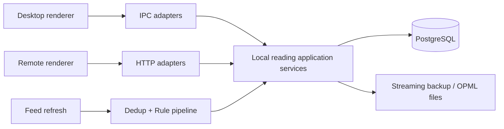
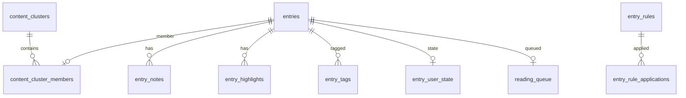

# Suhui 本地阅读工作流增强设计文档

## 二、需求信息

### 2.1 需求背景

Suhui 需要把本地 RSS 阅读从“能读”补齐为“可整理、可恢复、可持续处理”。规范来源为 `.loopx/intake/2026-08-12-local-reading-workflows/requirements.md`，澄清证据见同目录 `clarification.md`，方向提案见本目录 `设计提案.md`。

### 2.2 需求范围

- 本期：完整备份/恢复、本地 OPML、内容聚类、规则、文章标签、笔记/高亮、独立阅读队列、Desktop/Remote 共用服务。
- 非目标：云同步、在线 AI 聚类、通用规则 DSL、跨条目共享注释。
- 约束：PostgreSQL 是唯一持久化真相；不删除原始重复文章；迁移 additive；现有阅读行为兼容。
- 辅助 skills：`architecture-designer`、`sql-style`。

### 2.3 可行性分析

现有 main application/transport 分层、PostgreSQL、分页查询、收藏表与 Remote runtime client 可复用。主要风险是恢复原子性、大正文导出内存、聚类误判、规则重试和高亮漂移；方案通过流式格式、事务、派生/用户数据分离、幂等键和 orphan 状态控制风险。

## 三、概要设计

### 3.1 方案总述

新增一个由 main process 所有的本地阅读工作流域。刷新写入条目后调用 dedup 与 rule pipeline；Desktop/Remote 通过 application service 查询和修改用户数据；备份服务覆盖所有 canonical 表与必要设置。

### 3.2 整体架构设计

### 3.3 核心流程设计

| 流程       | 触发                | 主流程                                      | 异常/补偿                            | 输出           |
| ---------- | ------------------- | ------------------------------------------- | ------------------------------------ | -------------- |
| 新文章处理 | refresh upsert 完成 | 指纹/聚类 -> 规则匹配 -> 幂等动作           | 单条失败记录错误，不回滚已持久化文章 | 聚类与用户状态 |
| 合并恢复   | 用户选文件          | validate -> transaction upsert              | rollback                             | 合并报告       |
| 完整替换   | 二次确认            | 安全快照 -> validate -> transaction replace | rollback + 保留快照                  | 恢复报告       |
| 历史规则   | 用户确认预览        | 同一查询生成预览 token -> 分批执行          | token 过期则重新预览                 | 命中/变更数    |
| 高亮恢复   | 正文变化/打开文章   | offset 校验 -> quote/context 查找           | 多义/缺失标 orphaned                 | 定位状态       |

### 3.4 功能模块

| 模块              | 职责                                  | 依赖                        |
| ----------------- | ------------------------------------- | --------------------------- |
| Backup/OPML       | 文件格式、校验、事务恢复、订阅交换    | DB、filesystem              |
| Dedup             | 指纹、聚类、代表选择、重建            | entries、用户状态           |
| Rules/Tags        | 条件、预览、幂等动作、隐藏/标签       | entries、collections、queue |
| Annotations       | 笔记、高亮、重定位                    | entries                     |
| Reading Queue     | pending/completed 生命周期和统计      | entries                     |
| Query integration | 折叠/展开、隐藏过滤、transport parity | EntryQueryService           |

### 3.5 新增/调整功能说明

Desktop 新增数据管理、规则管理、文章注释、稍后读与重复来源交互；Remote 提供等价核心读写能力。现有收藏仍表示长期保留，稍后读表示待处理。

### 3.6 专项设计检查

| 辅助 skill              | 检查                       | 结论                                                    |
| ----------------------- | -------------------------- | ------------------------------------------------------- |
| `architecture-designer` | 所有权、失败、可恢复性     | main application 层统一；transport 无业务事务           |
| `sql-style`             | schema、索引、迁移、批处理 | additive tables；稳定唯一键；set-based/分批；恢复单事务 |

## 四、详细设计

### 4.1 备份与 OPML

#### 4.1.1 需求内容

Desktop 文件选择器调用完整备份服务；Desktop 与 Remote 调用同一 OPML 服务。完整备份包含正文、笔记和设置，在 Remote 最小鉴权落地前不得暴露 HTTP 下载或恢复接口。

#### 4.1.2 方案设计

**Data Contract `D-001`（AC-001, AC-002）**：`.suhui-backup` 是 UTF-8 NDJSON。首行 `{type:"manifest",format:"suhui-backup",version:1,createdAt,...}`；数据行 `{type:"record",entity,key,value}`；末行 `{type:"footer",recordCount,entityCounts,sha256}`。SHA-256 覆盖 manifest 后换行及全部 record 原始行，不覆盖 footer。未知 major、缺 footer、计数或 hash 不符全部拒绝。

**Behavior Contract `D-002`（AC-002）**：merge 只 upsert，不删除；replace 必须携带刚生成的确认 token，先将当前状态写入安全快照，再在单连接事务内按依赖顺序清空 canonical 表并导入。失败 rollback，快照保留；成功后报告计数。

**Interface Contract `D-003`（AC-003）**：OPML 2.0 本地解析与生成，只处理 `outline[type=rss|atom]` 的 `xmlUrl/title/text/category`；canonical URL 冲突作为 skipped，不产生重复订阅。OPML 不包含阅读数据。

#### 4.1.3 流程步骤

导出逐表稳定排序并逐行写文件；导入先复制到权限受限的 staging 文件并验证，再从同一固定文件句柄在事务中写入，避免验证后替换源文件。Remote OPML 使用有界 XML 请求体；完整备份保持 Desktop-only。

#### 4.1.4 边界条件

| 场景           | 处理                        | 感知      |
| -------------- | --------------------------- | --------- |
| 空库           | 生成合法零记录 bundle       | 可恢复    |
| 非法/超大行    | 拒绝并报告行号              | DB 不变   |
| 重复 key       | 文件验证失败                | DB 不变   |
| 磁盘满         | 中止、清理未完成临时文件    | 原库不变  |
| replace 并发写 | 恢复期间 application 写门禁 | 明确 busy |

#### 4.1.5 不变行为

旧 JSON merge import 暂保留；订阅 URL 去重规则、现有 DB 连接配置不变。

### 4.2 内容聚类

#### 4.2.1 需求内容

新文章自动聚类，普通列表折叠，用户可展开、拆分并手动指定代表。

#### 4.2.2 方案设计

**Data Contract `D-004`（AC-004, AC-011）**：`content_clusters` 保存 cluster 与人工代表；`content_cluster_members` 保存 `entry_id -> cluster_id`、算法版本、basis 与 fingerprint。member 是可重算派生数据；manual representative 是用户数据，只有用户或删除关联条目时改变。

**Behavior Contract `D-005`（AC-004）**：候选键顺序为 canonical URL、规范化标题+正文签名。只在相邻发布时间窗和不同来源内聚类；代表排序为 manual > 有队列/收藏/注释用户投入 > 正文长度 > 最早 publishedAt > entryId。聚类不传播状态。

#### 4.2.3 流程步骤

对新增条目规范化；查询候选索引；无候选创建 cluster，有候选加入；异步更新代表视图。历史 rebuild 分批且可重复。

#### 4.2.4 边界条件

同源相同 GUID 由现有刷新去重处理，不再形成展示聚类；误判可拆分；算法升级只重算 members，不覆盖 manual；缺标题/URL/正文的条目不做模糊聚类。

#### 4.2.5 不变行为

原始 entry ID、已读、收藏、分页详情不改；展开模式返回原始顺序。

### 4.3 规则与文章标签

#### 4.3.1 需求内容

来源+标题关键词规则处理新文章，历史应用需预览确认。

#### 4.3.2 方案设计

**Data Contract `D-006`（AC-005, AC-006）**：`entry_rules` 保存 name/enabled/feedIds/titleKeywords/actions/version；`entry_rule_applications(rule_id,entry_id,rule_version)` 唯一保证幂等；`entry_user_state` 保存 hidden；`entry_tags` 以 `(entry_id,tag)` 唯一。

**Behavior Contract `D-007`（AC-005, AC-006）**：条件组内来源集合为 OR、关键词为任一包含匹配，两组同时存在时 AND；关键词 Unicode case-fold/trim。动作合并为单事务，隐藏不删除。编辑规则 version+1，只影响新应用；历史 preview 返回短期 token、命中数与动作摘要，execute 必须携带 token。

#### 4.3.3 流程步骤

refresh 得到新 entry IDs；加载 enabled rules；数据库筛选候选；对未应用 version 的 pair 执行动作并记录 application；广播一个 changeset。

#### 4.3.4 边界条件

空条件规则拒绝；空动作拒绝；删除规则保留 application 审计但不再执行；重复 execute 幂等；预览 token 规则版本变化后失效；部分批次失败可从未记录 pair 继续。

#### 4.3.5 不变行为

订阅 category 永不被文章标签动作修改；普通手动已读/收藏行为不变。

### 4.4 笔记与高亮

#### 4.4.1 需求内容

逐篇多笔记、多高亮，支持重新定位、失效展示、搜索和备份。

#### 4.4.2 方案设计

**Data Contract `D-008`（AC-007, AC-008）**：`entry_notes` 保存 id/entryId/content/timestamps；`entry_highlights` 保存 id/entryId/source/quote/prefix/suffix/start/end/status/timestamps。source 为 `rss|readability`，status 为 `active|orphaned`。

**Behavior Contract `D-009`（AC-007）**：重新定位先验证 offset quote，再搜索 quote；唯一匹配直接迁移，多匹配用 prefix/suffix 打分，不能唯一确定则 orphaned。原 quote/context 永不因失败清空。

#### 4.4.3 流程步骤

renderer 选择文字生成锚点；service 校验 entry 与内容；写入；正文改变或打开时调用 relocate；更新 status/offset。

#### 4.4.4 边界条件

空笔记/quote 拒绝；entry 删除后注释软删除或保留于备份恢复域；HTML 展示以纯文本定位；恶意 HTML 不进入 note 渲染；并发编辑使用 updatedAt 乐观检查。

#### 4.4.5 不变行为

正文内容和原始条目不因注释修改；聚类不共享注释。

### 4.5 阅读队列

#### 4.5.1 需求内容

独立 pending/completed 队列、重新加入、移除、积压和完成统计。

#### 4.5.2 方案设计

**Data/State Contract `D-010`（AC-009）**：`reading_queue(entry_id)` 保存 status、addedAt、completedAt、updatedAt。不存在=未加入；pending -> completed 仅显式完成；completed -> pending 为重新加入并刷新 addedAt；remove 物理删除队列记录但不影响 entry。

#### 4.5.3 流程步骤

动作通过 application service 原子更新；列表按 addedAt DESC；统计返回 pending count 和 7/30 天 completed count。

#### 4.5.4 边界条件

重复加入 pending 幂等；重复完成保留首次 completedAt；已读/未读和收藏变化不触发队列；不可见但未删除条目仍可从队列访问。

#### 4.5.5 不变行为

收藏表和已读字段不复用、不迁移、不联动。

### 4.6 查询与跨端集成

#### 4.6.1 需求内容

普通列表折叠/隐藏，管理与搜索可展开/包含隐藏；Desktop/Remote 一致。

#### 4.6.2 方案设计

**Interface Contract `D-011`（AC-010）**：application services 是 IPC/HTTP 的共享核心；transport 只做参数、权限和 envelope 映射。Entry list 增加可选 `deduplicate`（默认 true）与 `includeHidden`（默认 false），响应 summary 添加 additive cluster metadata。

**Workflow Contract `D-012`（AC-010, AC-011）**：刷新先持久化原始条目，再执行 dedup/rules；任一派生步骤失败不得回滚已抓取文章，但必须记录并可重跑。备份/replace 与普通写入互斥。

#### 4.6.3 流程步骤

Desktop 和 Remote 调用同一 CRUD/query；mutation 产生 changeset；renderer 失效相关列表、统计和详情。

#### 4.6.4 边界条件

旧客户端省略新参数得到默认折叠普通列表；无 cluster 数据时与现有返回相同；派生服务失败时展示原始条目而非隐藏数据。

#### 4.6.5 不变行为

现有 cursor、scope、read filter、详情 visibility、刷新和收藏接口继续工作。

## 五、存储类设计

### 5.1 库表设计

| 表                      | 主键/唯一                             | 关键索引                      |
| ----------------------- | ------------------------------------- | ----------------------------- |
| content_clusters        | id                                    | manual representative         |
| content_cluster_members | entry_id; unique(cluster_id,entry_id) | fingerprint, cluster_id       |
| entry_rules             | id                                    | enabled, updated_at           |
| entry_rule_applications | (rule_id,entry_id,rule_version)       | entry_id                      |
| entry_user_state        | entry_id                              | hidden                        |
| entry_tags              | (entry_id,tag)                        | tag                           |
| entry_notes             | id                                    | entry_id, updated_at          |
| entry_highlights        | id                                    | entry_id, status              |
| reading_queue           | entry_id                              | status+added_at, completed_at |

### 5.2 数据迁移/初始化

Additive `CREATE TABLE/INDEX IF NOT EXISTS`，不回填用户表。聚类历史回填为可暂停 batch；旧数据在未回填时按未聚类显示。回滚以停止新调用和保留新表为主，不做破坏性 down migration。

## 六、其他组件设计

### 6.3 定时任务/批处理

聚类 rebuild、历史规则 execute 与高亮 relocate 都按有界 batch，记录 cursor/progress；失败不自动无限重试。

## 七、接口设计

### 7.1 接口设计原则

所有 mutation 校验 ID/版本；历史规则 execute 和 replace restore 使用短期确认 token；错误码稳定且不返回备份正文。

### 7.2 接口清单

应用服务提供 backup export/validate/restore、opml parse/import/export、cluster get/set/rebuild、rules CRUD/preview/execute、tags CRUD、notes/highlights CRUD/relocate、queue mutate/list/stats。IPC 与 Remote HTTP 对适用能力映射同一 DTO；完整备份仅映射 IPC，Remote HTTP 在鉴权落地前不提供该能力。

## 八、系统发布

### 8.4 回滚方案

Schema additive 不删除。出现问题时关闭 UI/入库 pipeline，新表保留；原始条目继续按旧路径显示。replace restore 的每次操作前快照提供数据恢复证据。

## 九、系统监控与维护

记录备份版本/记录数/耗时/结果、聚类 batch/误差手动操作、规则命中/失败、orphan 高亮数、队列统计；不得记录正文、笔记或高亮原文。大表查询必须有有界 limit 和对应索引。

## 十、排期与规划

### 10.5 Planning Handoff

- `plan2exec` 可决定：文件拆分、DTO 名称、HTTP 路径、UI 组件位置、batch 默认大小和不改变语义的样式。
- 必须返回 `spec`：备份 major 格式、replace 原子性、聚类删除语义、规则默认历史范围、队列状态机、高亮失效语义变化。
- 必须返回 `clarify`：新增跨条目共享注释、自动删除重复内容、云同步等产品行为。
- 推荐下一步：`$plan2exec docs/loopx/design/2026-08-12-local-reading-workflows/需求设计文档.md`

## 十一、QA

### 11.2 待确认问题

无。

### 11.3 Verification Strategy / TC 覆盖映射

| TC         | D anchors    | 验证                                                                |
| ---------- | ------------ | ------------------------------------------------------------------- |
| TC-001/002 | D-001, D-002 | bundle round-trip、hash failure、merge/replace rollback integration |
| TC-003     | D-003        | offline OPML fixtures、URL conflict                                 |
| TC-004     | D-004, D-005 | cluster/representative/independent state tests                      |
| TC-005/006 | D-006, D-007 | new-only、preview token、idempotency、hidden query tests            |
| TC-007     | D-008, D-009 | annotation CRUD、relocate/orphan、backup                            |
| TC-008     | D-010        | queue state machine/stat tests                                      |
| TC-009     | D-011, D-012 | migration、IPC/HTTP parity、existing suite                          |

### 11.4 Design Contract Index / D-\*

| D anchor | Source AC  | Contract type | Decision summary                                          | Boundary / non-goal               | Downstream expectation    |
| -------- | ---------- | ------------- | --------------------------------------------------------- | --------------------------------- | ------------------------- |
| D-001    | AC-001/002 | data          | streaming v1 bundle + SHA-256                             | footer outside hash               | exact parser/writer tests |
| D-002    | AC-002     | behavior      | merge non-delete; replace snapshot+transaction            | legacy JSON cannot replace        | failure rollback evidence |
| D-003    | AC-003     | interface     | local OPML 2.0                                            | subscriptions only                | offline fixtures          |
| D-004    | AC-004/011 | data          | derived members, protected manual representative          | no state propagation              | rebuild-safe migration    |
| D-005    | AC-004     | behavior      | deterministic matching and representative order           | no deletion                       | false-positive escape     |
| D-006    | AC-005/006 | data          | versioned rule applications, tags/state                   | no subscription category mutation | idempotent unique keys    |
| D-007    | AC-005/006 | behavior      | new-only default, preview-confirm history                 | no silent history rewrite         | preview token tests       |
| D-008    | AC-007/008 | data          | entry-bound notes/highlights                              | no cluster sharing                | backup/search inclusion   |
| D-009    | AC-007     | behavior      | quote/context relocation or orphan                        | no silent deletion                | ambiguity tests           |
| D-010    | AC-009     | state         | independent pending/completed queue                       | no read/star coupling             | transition tests          |
| D-011    | AC-010     | interface     | shared services, additive query metadata                  | transport contains no policy      | parity tests              |
| D-012    | AC-010/011 | workflow      | persist entry before derived pipeline; restore write gate | no loss on derived failure        | failure/retry tests       |
