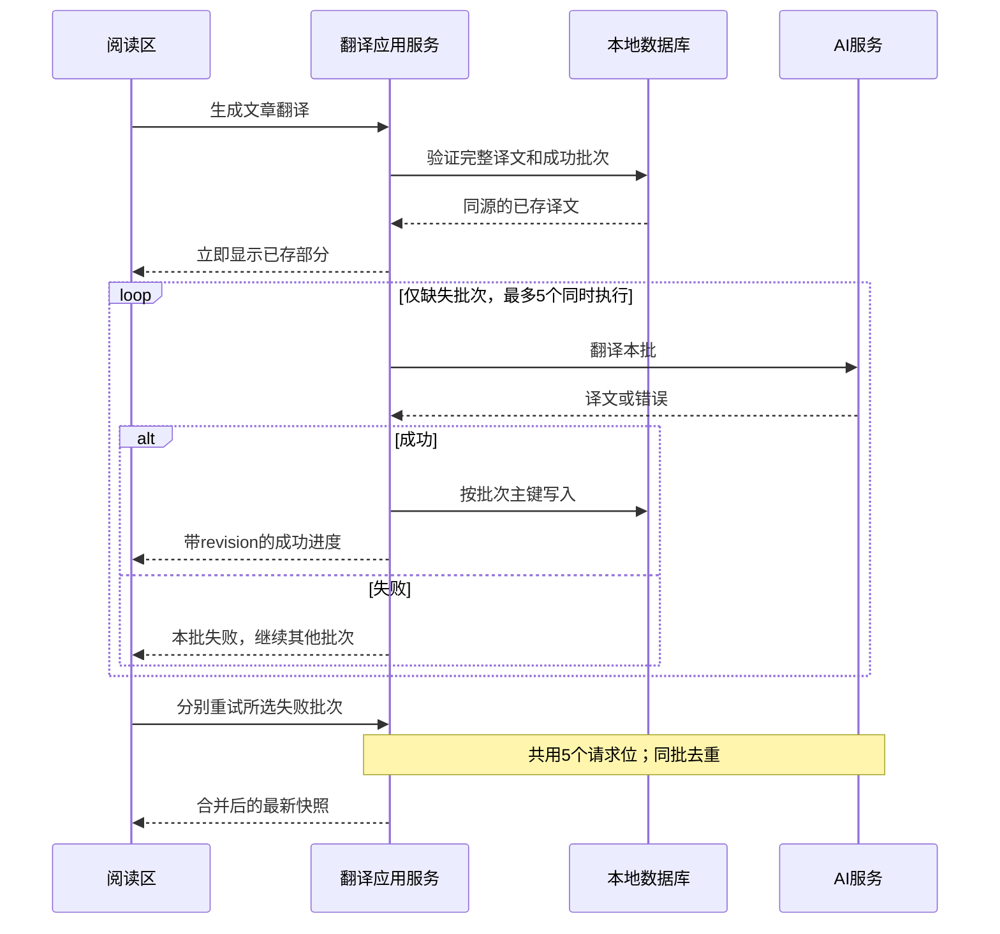
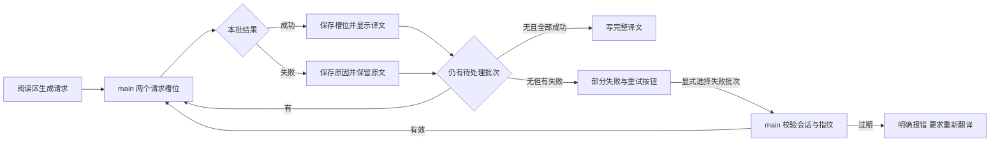

# 文章翻译改为显式触发、渐进呈现并支持可选 API 协议

Author(s): Codex
Last updated: 2026-09-04
Status: Accepted
Discussion: 当前会话，用户确认“文章按钮只控制当前文章，全局设置只控制自动翻译”并要求继续
Source requirements: 2026-09-04 用户反馈与确认
Support lenses: architecture-designer

## Abstract / 摘要

保留在线翻译为 Desktop 可选能力，新增文章级翻译按钮、明确的运行状态、段落批次渐进呈现、选中文字翻译，以及 OpenAI-compatible 的 Chat Completions / Responses 协议选择。成功批次按 D-010 持久化，完整字段继续单独保存；不自动跨协议重试，避免重复计费。

## Background / 背景与动机

当前 OpenAI-compatible 实现固定请求 `/v1/chat/completions`。本机 Sub2API 对 `grok-4.6` 的该请求返回 `unknown provider for model grok-4.6`，而同一模型存在大量 `/v1/responses` 成功记录。当前正文以约 18,000 字符批次串行翻译，并在标题、摘要、全部正文完成后才通过 `translation.generate` 返回；renderer 没有稳定的翻译中或部分完成状态。现有临时翻译命令藏在更多操作中，开启后仅改变布尔值。

## Goals And Non-Goals / 目标与非目标

目标：让用户选择兼容协议；快速看到长文首批译文与进度；在文章头部明确控制当前文章；支持显式的选中文字翻译；返回可诊断且不泄密的服务端错误。

非目标：不逐行调用模型；不实现 token/SSE 文本流；不把未完成原文混入完整译文缓存；不向 Remote 暴露翻译；不自动在两种协议间回退；不取消已经提交给上游的计费请求。

## Proposal / 设计方案

### 2026-09-16：五路并发与成功批次持久复用（用户已要求）

**D-010 · Behavior / Data / Interface Contract**：用户明确要求正文段落和重试并发度提高到 5，并要求成功译文存储、下次不重复调用 AI。沿用 D-009 的失败隔离与原文保护；将同文章/语言的请求上限改为 5，成功批次逐批持久保存。本文旧版“并发 2 / 部分成功仅内存 / 同文章重试串行”由本条替代。

所有权仍为 renderer translation store → Desktop IPC → EntryTranslationApplicationService / ReaderTranslationSession → TranslationService → 本地 DB。新增 `translation_batches` 作为成功批次的持久记录，既有 `translations` 仍只保存完整字段。没有新的网络服务、自动重试或全局速率策略。

- 正文与标题共享 5 个请求位；初次任务结束后不同失败批次可同时重试，第 6 个等待空位。同一批重复点击/请求共享在途结果，不重复调用；首轮运行中的重试按钮仍禁用。列表/完整生成任务维持文章级串行，等待已受理重试；多个重试不再互相串行。配置屏障等待生成及所有重试完成后切换配置，保留数据库译文和未完成会话。
- main 保留最近 16 个未完成会话对象；每次 provider 成功后先写对应批次，再发布已成功状态。正文逐批更新位置保护不变。持久写入失败明确记录为该批失败，在本会话保留已取得译文；显式重试仅补保存，不重发 AI。完整译文写失败依然显示错误。最终写入在数据库唯一键 upsert 中仅替换本次标题/正文，其他范围按同原文条件保留数据库当前值，避免跨正文类型并发重试覆盖。运行所需凭据在批次调度前只读取一次；读取失败为任务错误，不逐批再次读取。
- 重新打开文章或重启后，先验证完整译文；未完整时读取同文章/语言/原文指纹/分批版本的成功批次，立即投影部分 HTML，仅请求缺失批次。未完成会话对象被淘汰不再丢失已落库成果；过期按钮仍明确提示重新打开/继续翻译。
- 新的 reader 生成会话替代相同文章/语言/正文类型的旧会话；旧原文或旧分批版本不能套用到当前槽位，旧记录保留。用户明确裁定切换服务/模型/协议/API 配置继续复用已存译文；只对缺失批次使用当前服务。完整译文无时间过期；主动“重新翻译全文”通过 force 参数清除当前正文和标题的已存结果、生成新译文；不会跨文章猜测相同句子的上下文。
- 并发快照携带 main 单调 revision；renderer 保留初次请求作为会话身份，按 batchId 单独记录所有在途重试，迟到快照不能覆盖较新结果。任一重试结束不能把其他在途批次标成完成；只有无在途请求、无批次失败且无保存错误才显示完成。

**Data boundary**：新表主键为文章、语言、原文指纹、分批版本、target、batchId；configHash 只记生成配置来源，不参与复用或清理。payload 仅包含已校验字符串数组，不存 API key 或原始响应。独立批次行通过唯一键 upsert 避免并发快照覆盖，无应用数据库锁。完整 translations 按 created_at、批次按 updated_at 应用备份 merge 新鲜度条件，旧备份不得覆盖更新译文；replace 使用确认快照。`entry_id` 外键级联删除。完整译文和成功批次均长期保存、不按时间或配置变化自动删除；主动重译只清当前源的标题和指定正文，其他范围保留；同时失效同文章/语言所有旧 reader 会话，避免另一正文类型的旧标题写回。删除文章或用户清空数据沿既有语义清除。新增批次纳入完整备份和数据库转换，避免重启、恢复或换数据库丢失已付费成果。

**Migration / compatibility**：Postgres 使用既有幂等 CREATE TABLE DDL；SQLite 从 canonical schema 生成表、drizzle migration 和 baseline，升级账本可重复执行，无旧数据回填或破坏性 SQL。旧版忽略新增表，完整译文兼容。备份写 v2、读取 v1/v2，旧应用明确拒绝 v2；新增实体与父文章按既有顺序导入导出。翻译 generate 纳入 DBManager.runTrackedOperation，并注册维护参与者：停止新任务、等已受理任务全部落库、清内存会话后才切库/恢复。数据库转换在导出前额外暂停翻译至转换结束（可嵌套维护暂停），确保成功批次纳入导出。没有新增 Remote API。支持新建库和既有库升级验证。

**验证**：五路并行且第六路等待；不同失败批次重试同时运行与同批去重；乱序成功/失败/revision/导航；后续生成及配置变更等待所有已受理重试；跨会话/重启/配置变化复用成功部分且不发已命中请求；部分保存失败仅补写；原文/分批版本不误复用；完整译文命中零网络；主动重译；双方言迁移、实际 SQLite 并发行保存/级联删除及备份恢复。Support lenses: sql-style。图按运行序列人工核对，执行验证后补。

### 2026-09-16：批次失败隔离与手动重试（用户已要求，技术方案据此落地）

**D-009 · Behavior / Interface / Data Contract**：用户报告第 151/178 批超时，并要求失败批次跳过、段落处提供重试。阅读区标题/正文请求的 provider 批次失败只记录该批，不停止其他批次；失败处保留原文，正文就地显示重试，标题失败在状态区提供重试。全部调度结束但仍有失败时显示“部分失败”，不得显示“翻译完成”。不改变列表和选区的失败语义。

现有归属与扩展：`EntryTranslationApplicationService` 保留文章/语言队列、配置屏障及指纹校验，新增其私有会话检查点；HTML plan 负责批次槽位及失败标记；既有 translation store 投影进度；HTML renderer 将经过清洗的空标记映射为 React 控件，按钮还须匹配当前可信会话/失败批次，源站 HTML 不能自行触发请求。数据库仍只接受完整成功结果，无迁移、Remote 路由或新服务。

重试复用 `translation.generate`，附带会话 ID 与批次 ID；仅接受该会话已有失败批次。首轮运行期间按钮禁用，避免重复排队和打断原进度；结束后重试一批，其他失败批次继续可见。请求仍串行同文章，最多两个 provider 请求，重复点击在 renderer 同步去重；不自动重试、不提高超时。成功批次不重发。主进程只保留最近 16 个未完成阅读会话，配置更新清空，源内容改变拒绝旧会话；退出或淘汰后重试明确提示重新翻译，不静默从头请求；状态栏提供显式“重新翻译全文”调用当前 Query refetch。检查点不含解密密钥。完整成功后清理检查点；缓存写失败仍明确报错，不伪装完成；header/status 同时检查 store 错误，不能只沿用首次 Query 成功状态。

| 状态       | 事件                    | 结果                              |
| ---------- | ----------------------- | --------------------------------- |
| 翻译中     | 某批失败                | 更新失败集合，继续调度            |
| 翻译中     | 所有批次已处理          | 无失败则完成并缓存，否则部分失败  |
| 部分失败   | 点击有效失败批次        | 重试中，已有译文和其他失败保持    |
| 重试中     | 成功/失败               | 移除/更新本批错误；全部成功后缓存 |
| 任意旧会话 | 原文/配置变化或进程退出 | 拒绝旧重试，不能混用译文          |

验证按用户场景覆盖：失败后后续段落继续；乱序失败定位；只重试所选批次；重复点击不多发；重试再次失败；标题失败不阻断正文；过期会话拒绝；成功后才缓存；双语/仅译文均能就地重试且维持媒体节点和阅读位置。图已人工检查语义，尚未渲染；执行证据随后记录。此段修订下文旧版“某批失败整体失败”的边界。Support lenses: none（复用已确认的 main/store/renderer 归属）。

### 2026-09-15：阅读区与列表翻译分离（已确认）

用户确认：全文翻译只处理标题与正文，列表摘要按需单独翻译，摘要失败不再中断正文。

- 复用 `translation.generate` 的 `withContent`：`true` 为标题与指定正文（正文为空也不转为摘要请求）；`false` 或省略为列表标题与摘要。列表维持既有启用条件和按挂载条目请求，SocialMedia 使用正文范围。
- main 保留 `entryId:language` 串行队列、配置更新屏障及缓存指纹。失败只拒绝所属请求，后续队列任务仍运行；已有列表任务可能使正文排队，但不会把摘要错误传播给正文。保留该队列以维持最多两个请求槽位及整行缓存写入安全。
- renderer 在既有 translation store 内分别记录正文与列表任务的 requestId/进度；列表任务不得清除正文部分结果或覆盖正文进度。各请求只投影自身字段，迟到的列表缓存不能覆盖当前正文部分译文。
- 数据库复用一行翻译记录，“完整成功”按请求范围判断。成功后保留同源同配置下其他范围的缓存字段，失败不覆盖缓存。无新表、迁移、重试或超时调整。
- 验证：正文不请求摘要；空正文不转摘要；摘要失败后正文可成功；两种范围写入保留彼此缓存；renderer 观察者互不覆盖，迟到事件仍受 requestId 校验。

范围与状态归属：阅读区 → 正文 Query/正文进度；列表 → 列表 Query/列表进度；二者 → 同一 main 串行队列 → 经指纹校验的 translations 缓存。

1. OpenAI-compatible 配置增加 `apiProtocol = chat-completions | responses`。历史配置缺字段时按 `chat-completions` 读取，保持兼容；用户当前可显式选择 Responses。
2. 主进程 provider 根据协议生成请求，对调用方统一返回 `string[]`。单条输入请求纯文本并包装为单元素数组，避免普通段落依赖模型生成合法 JSON；多条行内片段仍请求并严格解析 `{translations: string[]}`，保持槽位对应。空译文、明确拒绝、失败或未完成结果不得当作成功缓存。此为 2026-09-15 重复 JSON 失败后的 provider 内部实现调整，不改变外部接口与请求数量。Responses 使用 `instructions + input`，读取 `output_text` 或标准 `output[].content[].text`。错误只提取 JSON 中的 `error.message/message/code`，移除当前 API Key 和常见密钥形态，并限制长度。
3. 正文按较小字符预算分批，最多两个批次并发。每批完成后，用原文填充尚未完成的文本槽，构建可渲染的部分 HTML，通过调用方 `WebContents` 的进度事件发送。最终完整结果才写数据库。
4. 文章头部常驻翻译按钮。按钮只覆盖当前打开文章，导航后清除覆盖；全局设置决定新文章是否自动开始。按钮呈现未开启、翻译中、部分完成、完成、失败状态。
5. 选择工具栏增加“翻译”。用户点击后只发送选中文字，结果显示在独立浮层，不进入文章翻译缓存。

## Support Lens Checks / 专项设计检查

| Support lens          | Trigger                                                  | Design checks applied                                            | Result                                                                     |
| --------------------- | -------------------------------------------------------- | ---------------------------------------------------------------- | -------------------------------------------------------------------------- |
| architecture-designer | Electron main/renderer 边界、渐进状态与外部 API 失败模式 | 数据所有权、IPC 定向发送、半成品一致性、失败恢复、兼容与资源上限 | main 持有密钥和 provider 调用；renderer 持有瞬时进度；数据库只持有完整结果 |

## Boundary Scenarios / 边界场景

- 空选择或仅空白：本地拒绝，不发送请求。
- 重复点击当前文章：复用 TanStack Query 的同 key 请求；不启动跨协议重试。
- 批次乱序完成：按原始槽位合并；进度单调增加。
- 阅读区某批失败：按 [D-009](#D-009) 继续调度、保留部分结果并提供单批重试；列表失败语义保持。
- 导航或旧事件迟到：renderer 以 `requestId + entryId + language` 丢弃不相关事件。
- 历史配置：缺少协议字段时继续使用 Chat Completions。
- 非 Desktop/Remote：选择翻译和全文翻译仍明确不可用。

## Rationale / 理由与取舍

| Alternative               | Why Not                                                                        |
| ------------------------- | ------------------------------------------------------------------------------ |
| 每行一次请求              | HTML 行不是稳定语义边界，请求数、费用和限流显著增加，且上下文质量下降          |
| token 级 SSE 直接改 DOM   | 需要复杂的流式 JSON 与 HTML 重建，错误恢复成本高；段落批次已能显著改善首屏延迟 |
| Chat 失败自动改 Responses | 可能产生重复计费，并掩盖网关模型路由配置错误                                   |
| 持久化每个部分批次        | 会让数据库暴露不完整文章，需要额外状态、迁移和清理语义                         |

## Compatibility / 兼容性

改动为加法。历史持久化配置、现有 `translation.generate` 最终返回值、translations 表结构和 Remote 边界保持不变。新增配置字段可选读取，保存后显式持久化。回滚旧版本时未知字段由 electron-store 保留但旧代码忽略。

## Operational And Security Impact / 运行与安全影响

最大外部并发固定为 2。进度事件只发送给调用方 WebContents。API Key 继续只在 main 解密；错误信息经过定长和密钥清理。超时或部分失败不落库，用户可手动重试。

## Implementation And Transition / 实现与过渡

先落协议与错误契约，再落渐进 IPC 与 renderer 会话状态，最后接入文章按钮和选择工具栏。无需数据库迁移。

## Open Questions / 待决问题

无。

## Detailed Design Handoff / 详细设计交接

立即编写详细设计；协议不自动回退、当前文章覆盖、最多两个正文批次并发、半成品不持久化和 Remote 不开放均为固定约束。
