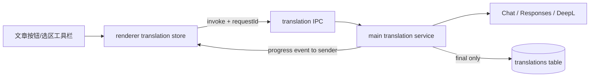

# 渐进式文章与选区翻译设计文档

> 2026-09-15 用户调整：普通段落独立翻译，大段落继续拆分；在线 AI 单次超时由 90 秒延长至 120 秒。以下分批合同已同步本次裁定。

## 一、修订历史

| 版本号 | 修订内容                                       | 修订时间   | 修订人 |
| ------ | ---------------------------------------------- | ---------- | ------ |
| V1.0.0 | 新建初稿，固化已确认的翻译入口、协议和渐进状态 | 2026-09-04 | Codex  |

## 二、需求信息

### 2.1 需求背景

- 背景：固定 Chat Completions 对当前 Grok 网关返回 HTTP 400；长文必须等待完整 RPC；文章内缺少明确按钮和状态。
- 需求目的：让协议可配置、错误可诊断、长文首批结果可快速呈现，并支持当前文章及选区的显式翻译。
- 目标用户/使用方：Desktop 本地阅读用户。
- 需求链接：当前会话 2026-09-04 用户反馈与确认。
- 关联原始材料：`AI-CONTEXT.md`“可选在线翻译”；同目录《设计提案.md》。

### 2.2 需求范围

- 本期范围：协议选择、安全错误详情、正文批次进度、文章按钮状态、选区翻译。
- 非目标：逐行请求、token 流、Remote 翻译、数据库中间态、自动协议回退、取消上游请求。
- 决策边界：文章按钮只覆盖当前文章；全局设置只决定自动触发。
- 依赖方：Electron IPC、主进程 translation service、内部 shared/store、Desktop renderer。
- 约束条件：密钥只在 main；最终缓存契约保持；并发上限 2；旧配置兼容。
- 触发的辅助 skills：architecture-designer。

### 2.3 可行性分析

- 技术可行性：`IpcContext.sender` 可定向发送进度，现有 HTML translation plan 可按槽位重建。
- 替代方案：SSE/token 流和逐行请求均被拒绝，见《设计提案.md》。
- 关键风险：乱序进度、旧请求事件污染新文章、服务错误回显秘密、协议兼容差异。

验收标准：

- **AC-001**：用户可选择 Chat Completions 或 Responses；历史配置仍按 Chat 工作。
- **AC-002**：HTTP 错误展示清理后的 provider 原因，不显示 API Key 或无限长正文。
- **AC-003**：文章头部常驻按钮准确显示当前文章的开关、加载、部分完成、完成与失败状态；导航后清除手动覆盖。
- **AC-004**：长文按段落批次处理，首批完成即显示，进度单调，最大批次并发为 2，最终结果才持久化。
- **AC-005**：选择文字后可显式翻译并查看结果；空白不请求且选区结果不写文章缓存。
- **AC-006**：Remote、密钥边界、双语/仅译文、DeepL 和最终 `translation.generate` 返回形状保持兼容。

## 三、概要设计

### 3.1 方案总述

- 设计目标：把全有或全无的全文 RPC 扩展为“最终 Promise + 定向进度事件”。
- 总体思路：main 负责协议、并发、HTML 槽位和最终持久化；renderer 负责 requestId 过滤、瞬时状态和用户交互。
- 核心模块：shared translation contract、provider/service、translation IPC、store query bridge、文章头部和选择工具栏。
- 主要难点：保持完整缓存语义并正确合并乱序批次。
- 技术指标：按段落分批，超过 2,000 字符的大段落再拆分；最大并发 2；错误详情不超过 500 字符。

### 3.2 整体架构设计

### 3.3 核心流程设计

| 流程         | 触发条件           | 主流程                                                  | 异常/补偿                          | 输出                 |
| ------------ | ------------------ | ------------------------------------------------------- | ---------------------------------- | -------------------- |
| 当前文章翻译 | 按钮或全局自动     | requestId → 元数据 → 正文批次并发 → 部分事件 → 最终写库 | 失败保留会话部分结果，不写最终缓存 | 状态、进度、最终译文 |
| 选区翻译     | 用户点击选区“翻译” | 校验文本 → 单次 provider 请求 → 浮层                    | 显示安全错误，可重试               | 单段译文             |

### 3.4 功能模块

| 模块      | 职责                                        | 依赖                                  |
| --------- | ------------------------------------------- | ------------------------------------- |
| provider  | 两种 OpenAI 协议、DeepL、响应解析、安全错误 | Electron fetch adapter                |
| service   | HTML 槽位、批次并发、最终缓存、选区调用     | provider、database                    |
| IPC/store | requestId 与进度定向传递、瞬时状态          | Electron IPC、TanStack Query、Zustand |
| renderer  | 按钮状态、部分正文、选择结果                | store                                 |

### 3.5 新增/调整功能说明

- 设置：OpenAI-compatible 增加协议选择。
- 主进程：增加选区翻译方法和进度回调；不增加 Remote HTTP 路由。
- renderer：文章头部新增常驻按钮，选择工具栏新增翻译动作。

### 3.6 专项设计检查

| 辅助 skill            | 触发原因                | 检查内容                                 | 设计结论                                                 |
| --------------------- | ----------------------- | ---------------------------------------- | -------------------------------------------------------- |
| architecture-designer | 跨 main/renderer 状态流 | 所有权、失败模式、并发、兼容、安全、运维 | 瞬时状态归 renderer，密钥/外部调用归 main，完整缓存归 DB |

## 四、详细设计

### 4.1 协议与 provider 详细设计

#### 4.1.1 需求内容

- 入口：设置保存/测试、全文翻译、选区翻译。
- 调用方：Desktop renderer。
- 前置条件：有效 Base URL、API Key、模型和协议。
- 输出结果：与输入等长的译文数组或安全错误。

#### 4.1.2 方案设计

- **D-001 / AC-001 / compatibility contract**：`apiProtocol` 为 `chat-completions | responses`；缺失时读取为 Chat，保存后显式写入并进入配置指纹。
- **D-002 / AC-002 / security contract**：仅从 JSON allowlist 字段提取错误，清理当前 key/常见 key，折叠空白并截断 500 字符。
- 不自动重试另一协议；相同用户动作最多使用一个协议。
- provider 对调用方仍返回等长字符串数组；单条输入按纯文本取回译文，多条片段继续校验 JSON 数组。Responses 明确 `failed/cancelled` 或 `incomplete/in_progress/queued` 时拒绝；显式 refusal/content_filter 及单条空译文也拒绝。完成状态缺省保持兼容，不猜测响应文本或补齐 JSON。

#### 4.1.3 流程步骤

1. 根据配置选择 endpoint 与请求体。
2. 调用隔离 Electron Session。
3. 校验 HTTP 与译文数组长度。

#### 4.1.4 边界条件

| 场景                           | 处理方式                   | 用户感知       | 监控/告警 |
| ------------------------------ | -------------------------- | -------------- | --------- |
| 旧配置无协议                   | 使用 Chat                  | 行为不变       | 不告警    |
| Responses 只有标准 output 数组 | 聚合 `output_text` 内容    | 正常结果       | 单测      |
| 错误回显密钥                   | 替换为 `[REDACTED]`        | 可诊断但无秘密 | 单测      |
| 协议不支持                     | 原样返回安全 provider 原因 | 明确失败       | toast     |

#### 4.1.5 不变行为

| 行为/表面               | 保持不变的原因 | 验证方式               |
| ----------------------- | -------------- | ---------------------- |
| DeepL JSON 合约         | 非本次问题     | provider tests         |
| API Key 不进入 renderer | 安全边界       | service/settings tests |

### 4.2 渐进全文翻译详细设计

#### 4.2.1 需求内容

- 入口：当前文章按钮或全局自动。
- 输出结果：部分 HTML 事件与既有完整最终结果。

#### 4.2.2 方案设计

- **D-003 / AC-004 / state contract**：正文按块级段落、换行和空行独立分批；同段行内文本节点保持同批。大段落超过 2,000 UTF-16 code units 时优先在句子边界拆分，超长单句按空白边界或不切断代理对的字符边界拆分。两个 worker 处理，结果写回原节点及片段槽位，完成计数只增不减。
- **D-004 / AC-004 / data contract**：部分结果保留于 main 会话检查点及 renderer Zustand；translations 表只写本请求范围内完整成功结果，并保留同源同配置下其他范围已有字段。
- **D-005 / AC-004 / interface contract**：进度事件携带 `requestId/entryId/language/completedBatches/totalBatches/translation`，仅发给调用 sender。
- 并发控制不使用数据库锁；既有 `entryId:language` main 队列串行同文章最终写入。乱序批次通过槽位索引合并，不依赖完成顺序。

#### 4.2.3 流程步骤

1. renderer 生成 requestId 并监听固定 channel。
2. `withContent=true` 只翻译标题与指定正文（空正文只翻译标题）；`false` 或省略仅翻译列表标题/摘要。列表按既有启用条件独立请求，不参与阅读区成功或失败判定。正文请求中的标题与正文共用两个请求槽位。
3. 两个 worker 消费正文批次，每批完成后发送可渲染部分 HTML 和进度。
4. 本范围全部完成后写缓存并返回；renderer 仅合并本范围字段并结束对应进度，正文与列表的 requestId 独立。列表请求不订阅正文进度。main 继续串行同文章任务以避免整行缓存覆盖，前一个任务失败不传播给后一个。

#### 4.2.4 边界条件

| 场景                 | 处理方式                        | 用户感知                                            | 监控/告警      |
| -------------------- | ------------------------------- | --------------------------------------------------- | -------------- |
| 空正文               | 阅读区只翻译标题，不请求摘要    | 快速完成                                            | 单测           |
| 大段落或单文本槽过长 | 优先按句子、再按词/字符边界拆分 | 分片完成即更新，保留 HTML 结构                      | 进度可见       |
| 批次乱序             | 按 offset 合并                  | 内容位置稳定                                        | 单测           |
| 阅读区某批失败       | 继续调度，不写完整缓存          | 失败处原文与单批重试，见 [D-009](设计提案.md#D-009) | 定向进度与诊断 |
| 导航后迟到事件       | requestId/entryId 过滤          | 新文章不受污染                                      | 单测           |

#### 4.2.5 不变行为

| 行为/表面                        | 保持不变的原因   | 验证方式             |
| -------------------------------- | ---------------- | -------------------- |
| 最终 generate 返回形状           | store/IPC 兼容   | shared/service tests |
| HTML 标签、媒体、URL、代码不外发 | 隐私与渲染正确性 | html tests           |

### 4.3 文章按钮与选区翻译详细设计

#### 4.3.1 需求内容

- 入口：文章头部常驻按钮、选择工具栏。
- 输出结果：当前文章翻译状态或选区翻译浮层。

#### 4.3.2 方案设计

- **D-006 / AC-003 / behavior contract**：当前文章覆盖为 `follow-global | force-on | force-off`，导航时回到 `follow-global`。按钮显示有效状态和 Query 进度。
- **D-007 / AC-005 / behavior contract**：选区仅在点击时调用 `translateText`，结果不缓存到文章表；空白输入在 main 再校验一次。
- 重复选择调用互相独立；按钮重复点击由当前 Query key 去重，不增加数据库协调。

#### 4.3.3 流程步骤

1. 文章按钮读取全局自动值、当前覆盖和 Query/进度状态。
2. 点击切换当前有效状态；关闭时只隐藏/停止后续自动触发，不承诺取消已发上游请求。
3. 选区按钮等待单次结果并打开浮层；失败显示可复制 toast。

#### 4.3.4 边界条件

| 场景             | 处理方式                             | 用户感知           | 监控/告警 |
| ---------------- | ------------------------------------ | ------------------ | --------- |
| 全局开、当前关闭 | force-off 优先                       | 按钮关闭且显示原文 | 不告警    |
| 全局关、当前开启 | force-on 优先                        | 当前文章开始翻译   | 进度可见  |
| 导航             | 清空 override；旧进度按 entryId 隔离 | 新文章跟随全局     | 单测      |
| 空白选区         | 拒绝                                 | 不发网络请求       | 单测      |

#### 4.3.5 不变行为

| 行为/表面                | 保持不变的原因 | 验证方式       |
| ------------------------ | -------------- | -------------- |
| 双语/仅译文设置          | 用户既有偏好   | renderer tests |
| 高亮、复制、分享选择动作 | 独立功能       | toolbar tests  |

## 六、其他组件设计

### 6.2 配置设计

| 配置项                                                   | 环境    | 默认值                  | 是否动态生效     | 说明         | 风险                     |
| -------------------------------------------------------- | ------- | ----------------------- | ---------------- | ------------ | ------------------------ |
| `translationProviderConfig.openAICompatible.apiProtocol` | Desktop | 旧数据 Chat，新 UI Chat | 是，保存后清缓存 | 上游请求协议 | 选错协议明确失败，不回退 |

## 七、接口设计

### 7.1 接口设计原则

进度沿用原通道；阅读区部分失败按 D-009 返回附加批次状态，完整成功仍返回既有字段；事件必须有 requestId；错误不得包含密钥；选择翻译仅 Desktop。

### 7.2 接口清单

| 接口                        | 调用方   | 服务方            | 权限/认证        | 幂等                 | 备注                             |
| --------------------------- | -------- | ----------------- | ---------------- | -------------------- | -------------------------------- |
| `translation.generate`      | renderer | main              | Desktop IPC      | Query key/主进程队列 | 请求可带 requestId，最终响应不变 |
| `translation-progress`      | main     | invoking renderer | 定向 WebContents | requestId            | 瞬时事件                         |
| `translation.translateText` | renderer | main              | Desktop IPC      | 无                   | 只翻译显式选择文本               |

### 7.3 接口明细

- **D-008 / AC-006 / interface contract**：不新增 Remote HTTP 翻译接口；所有新增接口只在 Desktop IPC。
- `translation-progress` 的 translation 字段沿用 `GeneratedEntryTranslation`，允许字段为 null；`completedBatches <= totalBatches`。
- `translateText` 输入为 `{ text, language }`，空白或超出 20,000 字符明确拒绝。

## 八、系统发布

### 8.4 回滚方案

回滚代码无需数据迁移；旧版本忽略新增协议字段。未完成部分结果仅在内存中，进程退出即清除。

## 九、系统监控与维护

### 9.2 性能与容量

- 外部请求并发：单篇正文最多 2。
- 普通段落各自一批；长段落以 2,000 UTF-16 code units 为拆分阈值，不跨段凑批。
- 在线 AI 每次请求最多等待 120 秒；DeepL 保持 60 秒，不自动重试。
- renderer 每个活动全文请求仅保留一份最新部分结果。

### 9.3 可靠性与兜底

- 不做跨协议 fallback。
- 批次失败不写最终数据库结果。
- 旧进度事件由 requestId 过滤。
- session/队列生命周期仍在单一 Electron main 进程内。

### 10.5 Planning Handoff

- `plan2exec` 可以决定：测试文件拆分、组件命名、状态派生 helper、精确 UI 样式。
- 必须返回 `spec` 的事项：持久化部分结果、改变数据库 schema、增加 Remote 路由、自动跨协议重试、提高并发上限。
- 必须返回 `clarify` 的事项：改变按钮与全局设置的优先语义、选区结果持久化。
- 推荐下一步：`$plan2exec docs/loopx/design/2026-09-04-progressive-translation/需求设计文档.md`

## 十一、QA

### 11.2 待确认问题

| 问题                     | 需要谁确认 | 阻塞阶段 | 推荐答案                          | 状态   |
| ------------------------ | ---------- | -------- | --------------------------------- | ------ |
| 文章按钮与全局自动的关系 | 用户       | clarify  | 当前文章 override，全局仅自动触发 | closed |

### 11.3 Verification Strategy / TC 覆盖映射

| TC                                | Source AC | Related D anchors | 设计级验证策略                       | 自动化/人工 | Deferred rationale |
| --------------------------------- | --------- | ----------------- | ------------------------------------ | ----------- | ------------------ |
| TC-001 历史配置与两协议请求/解析  | AC-001    | D-001             | provider/service/settings 单测       | automation  | 无                 |
| TC-002 400 原因可见且密钥清理     | AC-002    | D-002             | provider 错误响应单测                | automation  | 无                 |
| TC-003 当前文章 override 与状态   | AC-003    | D-006             | atom/helper 与 header component 单测 | automation  | 无                 |
| TC-004 乱序批次渐进合并且最终落库 | AC-004    | D-003,D-004,D-005 | html/service/store 单测              | automation  | 无                 |
| TC-005 选择翻译成功、空白与失败   | AC-005    | D-007             | service/store/toolbar 单测           | automation  | 无                 |
| TC-006 DeepL/Remote/最终形状回归  | AC-006    | D-008             | 全量测试与 Electron build            | automation  | 无                 |

### 11.4 Design Contract Index / D-\* 完整索引

| D anchor | Source AC | Contract type | Decision summary                     | Boundary / non-goal | Downstream expectation |
| -------- | --------- | ------------- | ------------------------------------ | ------------------- | ---------------------- |
| D-001    | AC-001    | compatibility | 显式两协议，旧配置 Chat              | 不自动探测          | 覆盖保存/读取/指纹     |
| D-002    | AC-002    | security      | allowlist 错误并清密钥、限长         | 不回显原始 body     | 红绿测试               |
| D-003    | AC-004    | state         | 段落分批、大段拆分、并发 2、槽位合并 | 不逐行/token 流     | 验证乱序               |
| D-004    | AC-004    | data          | 仅最终结果持久化                     | 不新增 DB 中间态    | 验证失败不写库         |
| D-005    | AC-004    | interface     | sender 定向 requestId 进度           | 不广播              | 验证过滤               |
| D-006    | AC-003    | behavior      | 当前文章三态 override                | 导航后清除          | UI 状态测试            |
| D-007    | AC-005    | behavior      | 选区显式翻译且不缓存                 | 20k 上限            | IPC/UI 测试            |
| D-008    | AC-006    | interface     | 新能力仅 Desktop IPC                 | Remote 不开放       | 边界回归               |

### 2026-09-16 批次恢复合同（D-009）

权威行为与生命周期见 [D-009](设计提案.md#D-009)。`GenerateEntryTranslationInput.retry` 可选 `{sessionId, batchId}`，仅用于 reader；会话绑定 entryId/language/target/sourceHash/configHash。`GeneratedEntryTranslation.batchState` 可选携带 sessionId、target、completedBatches、totalBatches、failedBatches（id、target、batchIndex、error）。IPC 进度沿用原通道并携带同一状态。completedBatches 只统计成功正文批次；标题失败独立列出。失败响应正常返回部分结果但 store 状态必须为 incomplete，不能依据 Query isSuccess 判定全文完成。重试结束后消除全部失败才更新完整缓存。

HTML plan 仅为失败正文批次输出空 span 标记，其值为 main 生成的会话 ID 和批次 ID；保留原文、不会插入上游错误文本。清洗仅允许受约束的标记值。renderer 的可信进度状态决定按钮是否存在及可操作；错误由 React 文本渲染。双语模式遇到未翻译块保留原文并迁移空标记，不重复原文。标记退出后原媒体/源节点 key 不受影响。

验证增加：service 故障隔离/重试/失效/完整缓存，store 部分失败终态/重试/迟到结果，HTML 标记/双语投影/清洗及 UI 点击状态。数据库与配置更新继续使用原队列和屏障，不新增并发写路径。

### 2026-09-16 实现验证

- 用户原始场景已覆盖：任一批超时/输出失败仍处理后续批次；失败处保留原文、只重试所选批次；重复点击去重；再次失败保留其他译文；标题失败不影响正文；源/配置/文章/语言/正文类型不匹配及 16 会话淘汰拒绝旧重试；缓存写失败不得报完成，状态栏可显式重新翻译全文。
- 完整测试：main 723 通过、12 个已有外部数据库测试跳过；store 139、renderer 450、utils 38 通过。随后 service 测试类型断言调整仅作静态非空标注，已单独复验。Electron Vite 构建通过。
- 隔离 Electron 原生布局检查使用真实 HTML 清洗、重试控件、React key 和 PreserveReadingPosition：Shadow DOM 内原生锚定开/关两种情况下，重试后可见段落位移 0，原文、媒体节点及 10 字符选区保留，按钮消失；并验证按钮回调。不是已安装应用的真实上游验证。
- 独立审查发现并修复：重试后的缓存写失败错误投影、会话过期缺少可用重启入口、非空未可信标记吞原文；复审无 Critical/Important。Markdown 图按分支与用户场景人工核对，未渲染验证。
- 静态检查仍有既有阻塞：main TypeScript 31 项配置/测试错误；renderer 的未修改 `useRepairFeed.ts` 有 2 项类型错误；受影响文件 lint 保留 10 项 HEAD 已有错误。新增生产代码无 lint error；未扩大修复无关问题。
- 证据：`/tmp/suhui-batch-main-full-final.log`、`/tmp/suhui-batch-store-full-final.log`、`/tmp/suhui-batch-renderer-full-final.log`、`/tmp/suhui-batch-utils-full.log`、`/tmp/suhui-batch-service-final.log`、`/tmp/suhui-batch-build-final.log`、`/tmp/suhui-batch-browser-result.log`、`/tmp/suhui-batch-lint-baseline.json`。验证时未安装；提交与推送状态以 Git 记录为准。

### 五路并发和持久成功批次（D-010）

用户 2026-09-16 新要求及边界见 [D-010](设计提案.md#D-010)。`translation_batches` 使用 entryId/language/sourceHash/planVersion/target/batchId 复合主键，values 为成功译文 string[]，updatedAt 为 ISO 时间（备份 merge 按既有 updated_at 新鲜度保护）；entryId 外键依附 entries。TranslationService 提供读取当前版本批次、单批 upsert 和清理；不存失败原文或响应体。planVersion 固定整数，分批/重建算法改变时须升版；恢复时再次校验批次存在、数组长度及每项类型。

应用服务的文章/语言队列协调完整生成和列表字段写入；单批 retry 只等待既有生成任务，不等待兄弟重试，另行跟踪全部在途 retry 供后续生成/配置屏障等待。每文章/语言共享 5 容量请求池，reader 内每个 batchId 的在途 Promise 去重。任务获得译文后等待单批保存，再标记完成；保存失败保留内存译文，下次本批 retry 不调用 provider。全部完成才更新 translations；不同生成会话有原文/正文类型校验及会话替代规则。

GeneratedEntryTranslation.batchState 新增 revision；store 的 requestId 标识初次生成世代，retryingBatchIds 集合标识各重试，generationActive 区分首轮与重试。每个单批 IPC 有独立 requestId，但回写必须同时匹配捕获世代、sessionId、source revision，并拒绝较旧 snapshot revision。重试按钮按本批是否在途禁用，其他失败批次继续可点；状态栏按整个世代的在途集合判断忙碌。

configHash 只保存生成来源，不影响复用。没有 TTL，移除未使用的七天清理方法。force 仅用于正文主动重译，清当前标题/正文完整字段和对应批次，普通打开继续补齐缺失。切换服务保留数据库记录。备份添加 translation_batches 实体并写 v2、兼容读取 v1/v2；双方言转换携带已存批次。升级为加表，无旧记录回填。测试按 D-010 场景执行，保留 D-009 的隔离、缓存错误、可操作恢复入口、安全 marker 及阅读稳定性回归。

### D-010 验证记录（2026-09-16）

- 用户原始要求：正文与不同失败批次重试并发上限 5；成功批次写数据库长期保留；用户明确选择切换服务/模型仍使用已存译文，主动重译才覆盖。已覆盖五路及第六路排队、同批去重、乱序快照、部分入库失败仅补写、重启恢复、换配置完整/部分复用、主动重译及跨正文类型会话失效。
- main 734 项通过、12 项既有外部 PostgreSQL 测试跳过；renderer 451、store 141、database 59 项通过。后续仅格式/import/type 修正和配置屏障断言，按受影响范围复验。实际 SQLite 文件关闭后重开仍保留 7 个并行写入批次，验证双方正文原子合并、源变更隔离、级联删除；备份验证旧 v1 可读、v2 带完整译文和批次、旧 merge 不回退新结果、replace 可恢复快照。
- 独立审查提出并修复：维护/转换导出窗口、备份 merge 新鲜度、force 跨正文类型旧标题、并行重试完整字段覆盖、凭据逐批读取及凭据失败前的已有译文投影。复审未发现 Critical/Important。
- Electron Vite 构建通过；main TypeScript 31 项、renderer 2 项均与之前基线完全一致，数据库另有两处未修改测试的既有类型转换错误；本轮新增类型错误已修正。未连接真实 AI 服务，Postgres 实例集成测试未运行；验证时未安装。提交与推送状态以 Git 记录为准。
- 证据：`/tmp/suhui-five-main-full.log`、`/tmp/suhui-five-renderer-full.log`、`/tmp/suhui-five-store-full.log`、`/tmp/suhui-five-db-full.log`，以及同前缀 final/type/lint/build 日志。
