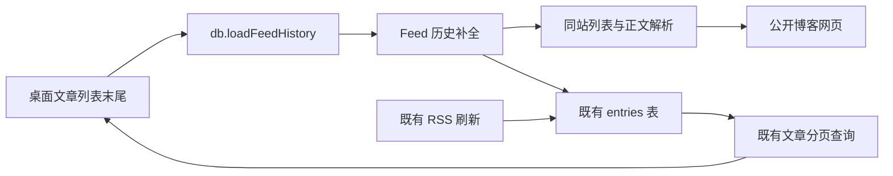
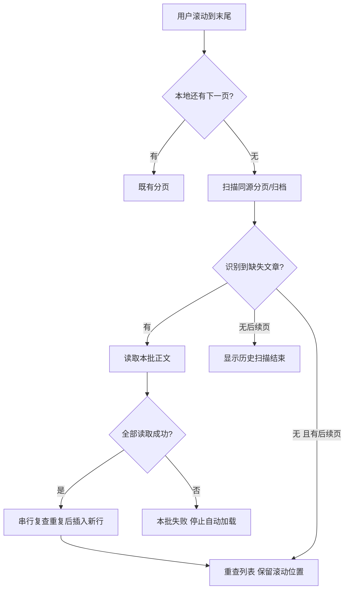

# 订阅历史文章补全

状态：2026-09-15，能力与自动触发方式已获用户明确授权；本文记录实现前的技术选择。代码已实现并完成独立安全评审；本次交付不包含应用安装或部署。

来源：本轮用户确认需要补全 RSS 之外的历史文章，并选择「滚动到底部就自动补全」。实例为 `https://lynan.cn/feed.xml`：实测 RSS 与本地各有 10 篇；网站首页显示 66 篇，提供同站分页。字段合同见[需求设计文档](需求设计文档.md)。

## 范围和复用

**D-001 · Behavior Contract**：桌面端单个文章订阅的本地分页耗尽后，继续向下滚动触发一批历史补全；新文章加入原订阅并默认未读。保留原订阅地址、已有文章及其已读、收藏、笔记、高亮。全部/分类/收藏聚合列表不触发抓取；Remote 不新增抓取接口。该行为由用户批准，批量大小属于实现参数。

**D-002 · Architecture Contract**：归属主进程 feed 应用模块；复用网页列表识别、Readability、原 entries 表和查询分页。已有 `FeedRefreshService.buildPreviewData` 只处理单份 RSS/网页，不能直接承担跨页补全，也不能把原订阅改成 sitescrape。新增 feed 内的补全服务与受约束的网页读取器，不建独立服务、不增加表或后台常驻爬虫。

调用与数据方向（新增历史分支）：

`ipc/services/site-scrape.ts` 是列表识别扩展点，`@mozilla/readability` 是正文解析依赖。`application/feed` 负责批次与临时扫描进度，数据库仍是文章唯一真相源。网络请求不占用条目写入协调区；最终合并与同订阅 RSS 刷新共用主进程串行边界，避免 GUID 不同但 URL 相同的文章重复创建。`DBManager.runTrackedOperation` 保证切库/恢复等待在途补全结束。

## 自动补全流程

**D-003 · Workflow Contract**：主进程从订阅的站点地址进入，沿真实的同源下一页与归档链接扫描，不猜文章地址。每批最多读取 4 个列表页、补入 10 篇完整正文；未处理候选留在当前进程内，下次到达末尾继续。已存在 URL 直接跳过，正文失败则本批不提交，前面已完成批次保留。错误停在页面上，由用户显式重试，不自动重试。

临时进度是可丢弃的扫描优化，不属于备份或同步事实；应用重启或切换数据库后重新扫描并按已存 URL 跳过。每个订阅扫描最多 100 个列表页，达到上限明确显示限制，不能宣称历史完整。只支持有静态文章列表/归档的公开站点；登录、验证码、JS 才生成的列表和外站文章不在本次范围，明确显示无法识别。网站更改布局可能减少可识别内容，不承诺任意博客都能全量补齐。

## 验证与状态

以 Lynan 10 篇 RSS + 网站分页为验收场景，验证补入更早文章、有正文、重复扫描无重复、后续 RSS 刷新复用原 ID、已读及笔记等保留。覆盖空页、单篇尾页、10/11 篇批次边界、下一页环路、网络中断、并发刷新、切换订阅和网络目标校验。

Support lenses：architecture-designer。设计推演确认正常路径和中途失败的提交边界；图与正文已人工对照，尚未渲染图。主进程、renderer、store 测试及 Electron 构建已执行，结果与限制见[验证记录](需求设计文档.md#verification-results)。
