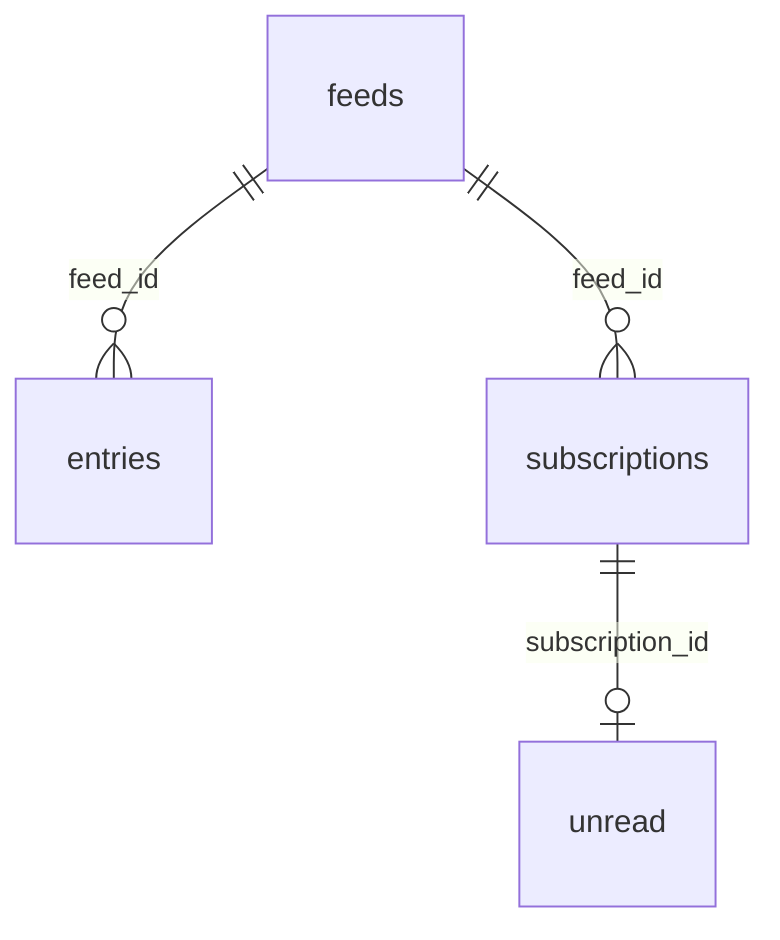

# Suhui Agent CLI设计文档

## 一、修订历史

| 版本号 | 修订内容 | 修订时间   | 修订人 |
| ------ | -------- | ---------- | ------ |
| V1.0.0 | 新建初稿 | 2026-06-05 | Codex  |

## 二、需求信息

### 2.1 需求背景

- 背景：Suhui 当前是 Desktop-only 的本地 RSS 阅读器，已经有 Electron main 内嵌 remote HTTP server 和远程浏览器入口。用户希望增加 CLI 能力，方便交给 agent 读取 Suhui 内容。
- 需求目的：让 agent 可以稳定读取文章列表、文章详情和订阅源导航信息，并能把 Markdown 内容直接发送给用户。
- 目标用户/使用方：本机或 LAN/VPN 内可访问 Suhui remote server 的 AI agent、自动化脚本、开发者。
- 需求链接：无外部链接。
- 关联原始材料：`.loopx/intake/clarify-suhui-agent-cli-20260605110641.md`、`AI-CONTEXT.md`、当前仓库代码。

### 2.2 需求范围

- 本期范围：
  - 新增 agent 专用 remote API：文章列表、文章详情、订阅源列表、已读/未读标记。
  - 新增 repo 内 CLI workspace 包 `apps/cli`，bin 命令名 `suhui`。
  - CLI 默认输出 Markdown，额外支持 JSON。
  - CLI 默认连接 `http://127.0.0.1:41595`，支持 `--base-url` 和 `SUHUI_CLI_BASE_URL` 覆盖。
- 非目标：
  - CLI 直接连接 Postgres。
  - 自动启动 Electron。
  - 随 Electron 安装器分发或自动加入 PATH。
  - 刷新订阅源、订阅增删改、全文搜索、高级过滤。
  - table UI、真实 Electron E2E、真实 Postgres 集成测试。
- 决策边界：
  - 现有 remote browser API 保持兼容。
  - `/api/agent/*` 输出是 agent schema，不承诺 DB 原始字段稳定。
  - agent API 跟随当前 remote server 暴露范围，不额外限制 localhost。
- 依赖方：
  - Electron main remote server。
  - main application services：entry、subscription、unread。
  - pnpm workspace。
- 约束条件：
  - 当前 `pnpm-workspace.yaml` 未包含 `apps/cli`，需要新增。
  - remote server 默认监听 `0.0.0.0:41595`，CLI 默认客户端地址应是 `127.0.0.1:41595`。

### 2.3 可行性分析

- 业务可行性：读取文章列表和详情是用户明确主场景，且与 Suhui 本地 RSS 阅读器定位一致。
- 技术可行性：现有 remote server 已有 `/api/entries`、`/api/entries/:id`、`/api/subscriptions`、`/api/unread`、`/api/entries/read` 能力；新增 agent API 可复用 application services。
- 团队接受能力：新增 CLI 包和少量 remote API，边界清晰，不侵入 renderer 主流程。
- 时间成本：中等。主要成本在 API contract、CLI 输出格式、Markdown 转换和测试。
- 资源成本：低。本机 HTTP 调用和有限分页查询，不需要新增服务进程。
- 替代方案：
  - CLI 直接连 Postgres：被拒绝，配置/迁移/并发风险更高。
  - CLI 调现有 `/api/entries` 后裁剪：被拒绝，可能全量拉取，性能和 schema 都不适合 agent。
- 关键风险：
  - agent API 不加 localhost 限制，LAN/VPN 内可读取文章内容。用户已接受。
  - Cursor 设计若不稳定可能分页重复或漏项。
  - HTML-to-Markdown 转换不保真，v1 只承诺可读。

## 三、概要设计

### 3.1 方案总述

- 设计目标：
  - 提供 agent 友好的 Suhui CLI。
  - 用稳定 agent schema 输出文章和订阅源。
  - 避免 CLI 直接访问数据库。
  - 控制列表返回体大小，避免全量拉取。
- 总体思路：
  - 在 Electron main remote server 新增 `/api/agent/*`。
  - 在 main application 层新增 agent-facing 查询/转换服务，聚合 entry/feed/subscription/unread。
  - 在 `apps/cli` 新增 Node CLI，调用 remote API 并渲染 Markdown/JSON。
- 核心模块：
  - AgentApplicationService。
  - RemoteServerManager agent routes。
  - CLI HTTP client。
  - CLI formatters。
- 主要难点：
  - 稳定分页 cursor。
  - Feed 标题和未读数聚合。
  - HTML-to-Markdown 可读转换和截断。
- 技术指标：
  - `entries list` 默认 20 条，最大 100 条。
  - 服务端执行 limit/cursor/filter。
  - remote unavailable 有稳定退出码。

### 3.2 整体架构设计

- 业务模式：Suhui Desktop 运行 remote server；CLI 作为独立 Node 客户端访问 remote API；agent 调 CLI 获取 Markdown 或 JSON。
- 系统边界：
  - CLI 不访问 Postgres。
  - CLI 不启动 Electron。
  - `/api/agent/*` 不改变现有 remote browser API。
- 上下游系统：
  - 上游：agent/用户 shell。
  - 中游：`apps/cli`。
  - 下游：Suhui remote HTTP server、main application services、Postgres。
- 应用架构：
  - `apps/cli`：参数解析、HTTP request、错误处理、格式化输出。
  - `apps/desktop/layer/main/src/application/agent`：agent schema 查询与转换。
  - `apps/desktop/layer/main/src/remote/manager.ts`：路由接入。
- 技术架构：
  - ESM TypeScript。
  - Node 内置 `fetch` 或轻量 HTTP client。
  - Vitest focused tests。
- 数据流转：
  1. Agent 调 `suhui entries list`。
  2. CLI 解析参数，确定 baseUrl。
  3. CLI 请求 `/api/agent/entries`。
  4. main 查询 DB/application services，聚合 feed 信息，返回 agent schema。
  5. CLI 渲染 Markdown 或 JSON 到 stdout。

### 3.3 核心流程设计

| 流程          | 触发条件                           | 参与系统/模块                                                   | 主流程                                                                           | 异常/补偿                           | 输出                    |
| ------------- | ---------------------------------- | --------------------------------------------------------------- | -------------------------------------------------------------------------------- | ----------------------------------- | ----------------------- |
| 文章列表      | `suhui entries list`               | CLI、agent API、AgentApplicationService、DB                     | 解析过滤参数，请求 API，按 cursor/limit 查询轻量字段，聚合 feedTitle，格式化输出 | remote 不可用退出 2；参数错误退出 1 | Markdown/JSON 列表      |
| 文章详情      | `suhui entries get <id>`           | CLI、agent API、AgentApplicationService、DB、Markdown formatter | 请求详情，选择正文来源，转换 Markdown，按 max-chars 截断                         | 找不到退出 3；格式异常退出 4        | Markdown/JSON 详情      |
| 订阅源列表    | `suhui feeds list`                 | CLI、agent API、subscription/feed/unread services               | 聚合 subscriptions、feeds、unread counts，按分类/标题输出                        | remote 不可用退出 2                 | Markdown/JSON feed 列表 |
| 标记已读/未读 | `suhui entries mark-read <ids...>` | CLI、agent API、EntryApplicationService                         | 解析明确 entry IDs，POST read 状态，remote 广播现有事件                          | 空 ID 参数错误；API 失败退出 1      | 操作结果                |

### 3.4 功能模块

| 模块                    | 职责                | 关键功能                                | 依赖                                                                   | 备注                 |
| ----------------------- | ------------------- | --------------------------------------- | ---------------------------------------------------------------------- | -------------------- |
| AgentApplicationService | 生成 agent schema   | entries list/get、feeds list、mark read | DBManager、EntryService、SubscriptionService、UnreadApplicationService | 建议新增目录         |
| Remote agent routes     | 暴露 `/api/agent/*` | 参数解析、状态码、JSON 响应             | RemoteServerManager                                                    | 不破坏现有 API       |
| CLI client              | 调用 remote API     | baseUrl 解析、HTTP、错误码              | Node runtime                                                           | 默认 127.0.0.1:41595 |
| CLI formatters          | 输出 Markdown/JSON  | list/detail/feed/error 格式             | HTML-to-Markdown 工具                                                  | 默认 Markdown        |
| Tests                   | 验证 contract       | API route、transform、CLI               | Vitest                                                                 | focused tests        |

### 3.5 新增/调整功能说明

- Desktop main：
  - 新增 agent application service。
  - 新增 `/api/agent/*` routes。
  - 保持现有 `/api/entries` 等 remote browser API 不变。
- CLI：
  - 新增 `apps/cli` workspace 包。
  - 新增 `suhui` bin。
  - 新增 `entries` 和 `feeds` 命令组。
- Workspace：
  - `pnpm-workspace.yaml` 增加 `apps/cli`。

## 四、详细设计

### 4.1 Agent Remote API 详细设计

#### 4.1.1 需求内容

- 入口：`/api/agent/*`
- 操作人/调用方：Suhui CLI、agent、自定义脚本。
- 前置条件：Suhui Desktop 已运行 remote server，DB ready。
- 输出结果：agent 专用 JSON schema。

#### 4.1.2 方案设计

- 核心逻辑：
  - 新增 `AgentApplicationService`，负责查询和聚合。
  - `entries list` 服务端处理 `feedId`、`read`、`limit`、`cursor`。
  - `entries get` 返回详情，并标注 content source。
  - `feeds list` 聚合 subscriptions、feeds、unread counts。
- 状态流转：读操作不改变状态；mark-read/mark-unread 修改 entry read 状态，并复用现有 broadcast。
- 数据变更：仅 `POST /api/agent/entries/read` 修改 `entries.read`。
- 计算公式：
  - `feedTitle = subscription.title || feed.title || feedId`。
  - `content = readabilityContent || content || description || ""`。
  - `contentSource = readabilityContent|content|description|none`。
  - `unreadCount` 使用现有 unread service 聚合结果。
- 幂等设计：
  - mark-read/mark-unread 对同一 entryId 重复调用结果一致。
- 权限/越权控制：
  - v1 不做 auth，不限制 localhost，跟随 remote server 当前暴露范围。
- 异常处理：
  - entry 不存在返回 404 和稳定错误码。
  - 参数非法返回 400。
  - 内部错误返回 500。
- 补偿/重试：
  - 查询无补偿。
  - mark-read 失败由调用方重试；服务端操作幂等。
- 日志与审计：
  - mark-read 复用现有 syncLogger 记录。
  - agent API 不新增强制审计日志。

#### 4.1.3 流程步骤

1. Remote manager 识别 `/api/agent/*` route。
2. 解析 query/path/body。
3. 调用 AgentApplicationService。
4. 返回 `{ data }` 或 `{ error }`。
5. 对写操作广播 `entries.updated` 和 `subscriptions.updated`。

#### 4.1.4 边界条件

| 场景             | 处理方式                                           | 用户/调用方感知         | 监控/告警 |
| ---------------- | -------------------------------------------------- | ----------------------- | --------- |
| remote 未启动    | CLI 连接失败                                       | 退出码 2                | 无        |
| entry 不存在     | API 404                                            | CLI 退出码 3            | 无        |
| limit 超过最大值 | clamp 到 100 或 400；建议 clamp 并在响应 meta 标明 | 仍返回最多 100 条       | 无        |
| cursor 非法      | 400 `SUHUI_INVALID_CURSOR`                         | CLI 退出码 1            | 无        |
| 正文为空         | 返回空 content/contentMarkdown                     | Markdown 显示无可用正文 | 无        |

### 4.2 CLI 详细设计

#### 4.2.1 需求内容

- 入口：`suhui` bin。
- 操作人/调用方：agent、用户 shell。
- 前置条件：Node CLI 可运行，Suhui Desktop remote server 可访问。
- 输出结果：Markdown 或 JSON 到 stdout；错误到 stderr。

#### 4.2.2 方案设计

- 核心逻辑：
  - 顶层解析 `--base-url`、`--format`。
  - baseUrl 优先级：CLI 参数 > `SUHUI_CLI_BASE_URL` > `http://127.0.0.1:41595`。
  - 默认 `--format markdown`。
  - `--format json` 输出稳定 JSON。
- 状态流转：CLI 无本地持久状态。
- 数据变更：仅 mark-read/mark-unread 通过 remote API 改 DB。
- 计算公式：
  - Markdown 时间使用 CLI 运行机器本地时间。
  - JSON 返回 `publishedAt`/`insertedAt` 毫秒时间戳和 ISO 字符串。
- 幂等设计：
  - mark-read/mark-unread 对明确 IDs 幂等。
- 权限/越权控制：
  - 无额外认证。
- 异常处理：
  - 参数错误退出 1。
  - remote 不可用退出 2。
  - not found 退出 3。
  - API schema 非预期退出 4。
- 补偿/重试：
  - v1 不自动重试写入；remote unavailable 可由 agent 重新调用。
- 日志与审计：
  - CLI 默认不写本地日志，避免污染 agent 输出。

#### 4.2.3 流程步骤

1. Agent 调用 CLI。
2. CLI 解析参数并构造 API URL。
3. CLI 发 HTTP 请求。
4. CLI 校验响应 schema。
5. CLI 按格式输出。
6. CLI 以约定退出码结束。

#### 4.2.4 边界条件

| 场景                          | 处理方式                       | 用户/调用方感知    | 监控/告警 |
| ----------------------------- | ------------------------------ | ------------------ | --------- |
| 同时传 `--read` 和 `--unread` | 参数错误                       | 退出 1             | 无        |
| `mark-read` 未传 ID           | 参数错误                       | 退出 1             | 无        |
| Markdown 正文超长             | 按 `--max-chars` 截断并标注    | 内容末尾有截断说明 | 无        |
| JSON schema 异常              | 报 `SUHUI_UNEXPECTED_RESPONSE` | 退出 4             | 无        |

### 4.3 Markdown 与 JSON Schema 详细设计

#### 4.3.1 需求内容

- 入口：CLI formatters。
- 操作人/调用方：CLI。
- 前置条件：已取得 agent API JSON。
- 输出结果：稳定 JSON 或可读 Markdown。

#### 4.3.2 方案设计

- JSON：
  - 稳定给 agent 解析。
  - 不暴露 DB 原始字段全集。
- Markdown：
  - 默认格式。
  - 列表不含摘要，除非 `--with-summary`。
  - 详情默认 full content，HTML 转 Markdown。
- 截断：
  - 默认 max chars 由实现决定，需求示例为 12000。
  - 截断必须显式标注。

#### 4.3.3 流程步骤

1. Formatter 接收 agent schema。
2. 选择 list/detail/feed/error 模板。
3. 对 HTML 内容执行 Markdown 转换。
4. 应用 max-chars。
5. 输出到 stdout/stderr。

#### 4.3.4 边界条件

| 场景          | 处理方式                       | 用户/调用方感知 | 监控/告警 |
| ------------- | ------------------------------ | --------------- | --------- |
| HTML 转换失败 | 降级为去标签文本或原始文本摘要 | 仍有可读内容    | 无        |
| 标题为空      | 使用 `(Untitled)`              | 可读占位        | 无        |
| 时间为空      | Markdown 显示 `Unknown time`   | 可读占位        | 无        |

## 五、存储类设计

### 5.1 库表设计

#### 5.1.1 数据库模型图

不新增数据库模型。复用现有 `feeds`、`subscriptions`、`entries`、`unread`。



#### 5.1.2 表结构

| 表名          | 用途         | 主键            | 关键索引 | 数据量预估       | 备注            |
| ------------- | ------------ | --------------- | -------- | ---------------- | --------------- |
| feeds         | RSS 源信息   | id              | 现有     | 用户订阅源数量   | 不新增字段      |
| subscriptions | 用户订阅关系 | id              | 现有     | 用户订阅关系数量 | 不新增字段      |
| entries       | 文章         | id              | 现有     | 文章数量可能较大 | list 必须 limit |
| unread        | 未读数       | subscription_id | 现有     | 订阅源数量       | 复用现有聚合    |

字段明细：

不涉及新增字段。关键读取字段：

| 字段                       | 类型    | 是否必填 | 默认值 | 含义      | 来源/取值逻辑 | 备注                      |
| -------------------------- | ------- | -------- | ------ | --------- | ------------- | ------------------------- |
| entries.id                 | text    | 是       | 无     | 文章 ID   | DB            | CLI 详情和 mark-read 使用 |
| entries.feedId             | text    | 否       | null   | 订阅源 ID | DB            | 用于聚合 feedTitle        |
| entries.title              | text    | 否       | null   | 标题      | DB            | 空值输出 `(Untitled)`     |
| entries.readabilityContent | text    | 否       | null   | 可读正文  | DB            | 详情优先内容来源          |
| entries.content            | text    | 否       | null   | 原始正文  | DB            | 第二内容来源              |
| entries.description        | text    | 否       | null   | 摘要      | DB            | 第三内容来源              |
| entries.publishedAt        | bigint  | 是       | 无     | 发布时间  | DB            | 排序和 cursor             |
| entries.insertedAt         | bigint  | 是       | 无     | 入库时间  | DB            | 排序 tie-breaker          |
| entries.read               | boolean | 否       | null   | 已读状态  | DB            | CLI filter/write          |

### 5.2 数据迁移/初始化

- DDL：无。
- DML：无。
- 数据回填：无。
- 老数据兼容：老文章可能缺少正文或标题，formatter 使用占位/降级。
- 新老系统读写关系：不改变现有桌面端/remote browser 读写关系。

### 5.3 缓存设计

不涉及。CLI v1 不做本地缓存。

## 六、其他组件设计

### 6.1 消息设计

不涉及新增消息系统。mark-read/mark-unread 后复用 remote server 现有 SSE broadcast：`entries.updated`、`subscriptions.updated`。

### 6.2 配置设计

| 配置项               | 环境           | 默认值                   | 是否动态生效 | 说明                  | 风险                                  |
| -------------------- | -------------- | ------------------------ | ------------ | --------------------- | ------------------------------------- |
| `SUHUI_CLI_BASE_URL` | CLI runtime    | 无                       | 是           | 覆盖 remote API 地址  | 指向非预期 remote 会读取/写入其他实例 |
| `--base-url`         | CLI invocation | `http://127.0.0.1:41595` | 是           | 单次调用覆盖 base URL | 同上                                  |
| `--format`           | CLI invocation | `markdown`               | 是           | `markdown` 或 `json`  | agent 如果期望 JSON 需显式指定        |

### 6.3 定时任务/批处理

不涉及。

### 6.4 技术组件

- 分布式锁：不涉及。
- 唯一 ID：不新增。
- 加解密/验签：v1 不做。
- 字典转换：content source、read state、format enum。
- Excel/文件处理：不涉及。
- 用户信息透传：不涉及。
- 限流/熔断：v1 不做；依赖本机/LAN 低频 agent 调用。

## 七、接口设计

### 7.1 接口设计原则

- `/api/agent/*` 是 agent 专用 contract，字段应完整注释并保持向后兼容。
- 列表接口必须服务端 limit，禁止全量返回后由 CLI 裁剪。
- Cursor 必须稳定，建议包含 `publishedAt`、`insertedAt`、`id` tie-breaker。
- 写接口只接受明确 entry IDs。
- 错误码和 CLI 退出码必须稳定。

### 7.2 接口清单

| 接口             | 调用方 | 服务方              | 权限/认证 | 幂等     | 文档地址 | 备注                           |
| ---------------- | ------ | ------------------- | --------- | -------- | -------- | ------------------------------ |
| Agent 文章列表   | CLI    | Suhui remote server | 无        | 查询幂等 | 本文档   | `GET /api/agent/entries`       |
| Agent 文章详情   | CLI    | Suhui remote server | 无        | 查询幂等 | 本文档   | `GET /api/agent/entries/:id`   |
| Agent 订阅源列表 | CLI    | Suhui remote server | 无        | 查询幂等 | 本文档   | `GET /api/agent/feeds`         |
| Agent 已读状态   | CLI    | Suhui remote server | 无        | 是       | 本文档   | `POST /api/agent/entries/read` |

### 7.3 接口明细

#### 7.3.1 Agent 文章列表

- 路径/方法：`GET /api/agent/entries`
- 请求头：无特殊要求。
- 请求参数：
  - `feedId?: string`
  - `read?: "true" | "false"`；CLI `--unread` 映射 `read=false`，`--read` 映射 `read=true`
  - `limit?: number`，默认 20，最大 100
  - `cursor?: string`
  - `withSummary?: "1" | "true"`
- 响应参数：

```json
{
  "data": {
    "items": [
      {
        "id": "entry_1",
        "feedId": "feed_1",
        "feedTitle": "Example Feed",
        "title": "Example Entry",
        "url": "https://example.com/post",
        "author": "Author",
        "publishedAt": 1710000000000,
        "publishedAtIso": "2024-03-09T16:00:00.000Z",
        "insertedAt": 1710000001000,
        "insertedAtIso": "2024-03-09T16:00:01.000Z",
        "read": false,
        "summary": "Optional summary"
      }
    ],
    "page": {
      "limit": 20,
      "nextCursor": "opaque-cursor-or-null",
      "hasMore": true
    }
  }
}
```

- 错误码：
  - `SUHUI_INVALID_LIMIT`
  - `SUHUI_INVALID_CURSOR`
  - `SUHUI_AGENT_INTERNAL_ERROR`
- 业务校验：
  - `read=true/false` 二选一。
  - `limit` 非数字按参数错误处理或 clamp；建议实现为 clamp 到 1..100。
- 数据变更：无。
- 日志字段：无强制。

#### 7.3.2 Agent 文章详情

- 路径/方法：`GET /api/agent/entries/:id`
- 请求头：无特殊要求。
- 请求参数：
  - path `id: string`
- 响应参数：

```json
{
  "data": {
    "id": "entry_1",
    "feedId": "feed_1",
    "feedTitle": "Example Feed",
    "title": "Example Entry",
    "url": "https://example.com/post",
    "author": "Author",
    "publishedAt": 1710000000000,
    "publishedAtIso": "2024-03-09T16:00:00.000Z",
    "insertedAt": 1710000001000,
    "insertedAtIso": "2024-03-09T16:00:01.000Z",
    "read": false,
    "content": "<article>...</article>",
    "contentSource": "readabilityContent",
    "description": "Short description"
  }
}
```

- 错误码：
  - `SUHUI_ENTRY_NOT_FOUND`
  - `SUHUI_AGENT_INTERNAL_ERROR`
- 业务校验：
  - 只返回 active visibility 下可见文章。
  - 内容来源优先级：`readabilityContent` > `content` > `description` > `none`。
- 数据变更：无。
- 日志字段：无强制。

#### 7.3.3 Agent 订阅源列表

- 路径/方法：`GET /api/agent/feeds`
- 请求头：无特殊要求。
- 请求参数：
  - v1 无必需参数。
- 响应参数：

```json
{
  "data": {
    "items": [
      {
        "id": "feed_1",
        "subscriptionId": "feed/feed_1",
        "title": "Example Feed",
        "url": "https://example.com/rss.xml",
        "siteUrl": "https://example.com",
        "category": "Tech",
        "unreadCount": 12
      }
    ]
  }
}
```

- 错误码：
  - `SUHUI_AGENT_INTERNAL_ERROR`
- 业务校验：
  - 只返回未删除订阅源。
  - `title = subscription.title || feed.title || feed.id`。
- 数据变更：无。
- 日志字段：无强制。

#### 7.3.4 Agent 已读状态

- 路径/方法：`POST /api/agent/entries/read`
- 请求头：`Content-Type: application/json`
- 请求参数：

```json
{
  "entryIds": ["entry_1", "entry_2"],
  "read": true
}
```

- 响应参数：

```json
{
  "data": {
    "updated": 2,
    "read": true
  }
}
```

- 错误码：
  - `SUHUI_INVALID_ENTRY_IDS`
  - `SUHUI_AGENT_INTERNAL_ERROR`
- 业务校验：
  - `entryIds` 必须非空。
  - v1 不支持 all/feed/filter 批量。
- 数据变更：
  - 更新 `entries.read`。
  - 复用现有 sync log 和 SSE broadcast。
- 日志字段：
  - 复用 `entry.mark_read` / `entry.mark_unread`。

### 7.4 CLI Contract

#### 7.4.1 命令清单

```bash
suhui entries list [--feed <feedId>] [--unread|--read] [--limit <n>] [--cursor <cursor>] [--with-summary] [--format markdown|json] [--base-url <url>]
suhui entries get <entryId> [--content full|summary|metadata] [--max-chars <n>] [--format markdown|json] [--base-url <url>]
suhui feeds list [--format markdown|json] [--base-url <url>]
suhui entries mark-read <entryId...> [--format markdown|json] [--base-url <url>]
suhui entries mark-unread <entryId...> [--format markdown|json] [--base-url <url>]
```

#### 7.4.2 退出码

| 退出码 | 含义                      |
| ------ | ------------------------- |
| 0      | 成功                      |
| 1      | 普通参数/执行错误         |
| 2      | remote API 不可用         |
| 3      | 找不到文章/feed           |
| 4      | remote API 返回非预期格式 |

#### 7.4.3 错误输出

JSON 模式：

```json
{
  "error": {
    "code": "SUHUI_REMOTE_UNAVAILABLE",
    "message": "Cannot connect to Suhui remote API at http://127.0.0.1:41595"
  }
}
```

Markdown 模式：

```markdown
Error: Cannot connect to Suhui remote API at http://127.0.0.1:41595
```

## 八、系统发布

### 8.1 灰度方案

- 灰度范围：repo 内开发 CLI 和本地 remote API。
- 灰度开关：无独立开关；功能随代码发布。
- 验证指标：focused tests 通过；手动启动 Suhui 后 CLI 能读取列表/详情。
- 放量节奏：v1 不做安装器分发，先面向开发/agent 使用。

### 8.2 降级方案

- 降级触发条件：CLI 或 `/api/agent/*` 出现问题。
- 降级行为：不使用 CLI；现有桌面端和 remote browser API 不受影响。
- 用户影响：agent 无法通过 CLI 读取 Suhui，但主应用可继续使用。
- 恢复方式：修复 CLI/API 或回退相关代码。

### 8.3 关联系统/功能影响

| 系统/功能                       | 影响            | 依赖动作            | 负责人 | 验证方式                          |
| ------------------------------- | --------------- | ------------------- | ------ | --------------------------------- |
| Desktop main remote server      | 新增 route      | 增加 tests          | 开发者 | Vitest route tests                |
| Desktop renderer remote browser | 不应影响        | 保持现有 API 兼容   | 开发者 | 现有 remote tests                 |
| Workspace                       | 新增 `apps/cli` | 更新 pnpm workspace | 开发者 | `pnpm --filter @suhui/cli` 可运行 |

### 8.4 回滚方案

- 回滚条件：agent API 影响 remote server 稳定性或 CLI contract 严重错误。
- 回滚步骤：移除/禁用 `/api/agent/*` route 和 `apps/cli` workspace 入口。
- 数据回滚：无新增表和迁移，无需数据回滚。
- 配置回滚：移除 workspace 配置即可。
- 风险：如果已被 agent 依赖，回滚会中断自动化读取。

## 九、系统监控与维护

### 9.1 监控与告警

- 系统异常：v1 不新增告警；remote server 现有日志覆盖 500 错误。
- 业务异常：CLI stderr 提供错误码。
- 重试异常：v1 CLI 不自动重试。
- 超时：CLI HTTP client 应设置合理超时，避免 agent 长时间挂起；具体数值 plan 可定。
- 关键接口指标：不新增 metrics。
- 告警渠道：无。

### 9.2 性能与容量

- TPS/吞吐：面向 agent 低频调用。
- CPU/内存/磁盘 IO/网络 IO：本机/LAN HTTP，主要压力在 DB 查询和正文转换。
- 数据容量：entries 可能较大，列表必须服务端 limit。
- 缓存容量：无 CLI 缓存。
- 跑批耗时：不涉及。
- 是否压测：v1 不压测，focused tests 覆盖 limit/cursor。

### 9.3 可靠性与兜底

- 幂等击穿：mark-read/mark-unread 幂等。
- 并发失效：多个 CLI 同时标记同一 entry，最终状态由最后写入决定，符合预期。
- 冷热备：不涉及。
- 数据一致性：读操作使用主进程 DB 当前状态；刷新不由 CLI 触发。
- 兜底：remote unavailable 时给明确错误和退出码。

## 十、排期与规划

### 10.1 建议阶段

1. Agent API contract 与 service：新增 schema、list/detail/feed/read API，并补 remote tests。
2. CLI package：新增 workspace、命令解析、HTTP client、formatters、CLI tests。
3. 验证与文档：补 README/usage，运行 focused tests 和 typecheck。

### 10.2 Planning Handoff

`plan` 可以自行决定：

- CLI 参数解析库或手写解析。
- HTML-to-Markdown 具体工具或轻量实现。
- 文件拆分和命名。
- Cursor 编码格式，只要稳定支持 `publishedAt/insertedAt/id` tie-breaker。
- CLI HTTP timeout 具体默认值。
- 测试 fixture 和 mock server 实现方式。

必须回到 `clarify` 或 `spec` 的情况：

- v1 范围加入刷新、订阅管理、搜索或高级过滤。
- 要求 CLI 直接读数据库。
- 要求 agent API 加认证/token/localhost-only。
- 要求随 Electron 安装器系统级分发。
- 改变默认输出格式或稳定 JSON contract。

推荐下一步：

```text
$plan docs/loopx/design/Suhui Agent CLI需求设计文档.md
```

## 十一、QA

### 11.1 测试范围

- Remote manager route tests：
  - `/api/agent/entries` 支持 limit/cursor/feed/read filters。
  - `/api/agent/entries/:id` 找到和找不到。
  - `/api/agent/feeds` 聚合 unreadCount。
  - `/api/agent/entries/read` 调用 updateReadStatus 并返回结果。
- Agent service/transform tests：
  - feedTitle fallback。
  - content source 优先级。
  - cursor tie-breaker。
  - JSON schema 不泄漏不需要字段。
- CLI tests：
  - 默认 Markdown。
  - `--format json`。
  - remote unavailable 退出码 2。
  - entry not found 退出码 3。
  - 参数冲突退出码 1。

### 11.2 验收用例

1. 启动 Suhui Desktop remote server 后运行 `suhui entries list`，输出 Markdown 列表，默认 20 条以内。
2. 运行 `suhui entries list --format json --limit 5 --unread`，输出稳定 JSON。
3. 从列表复制 entryId，运行 `suhui entries get <entryId>`，输出标题、来源、URL、正文 Markdown。
4. 运行 `suhui feeds list`，输出 feed 标题和未读数。
5. 运行 `suhui entries mark-read <entryId>` 后，对应文章 read 状态变为 true。
6. 未启动 Suhui remote server 时运行 CLI，退出码为 2，错误说明 remote unavailable。

### 11.3 不测范围

- 真实 Electron E2E。
- 真实 Postgres 集成测试。
- 安装器分发和 PATH 注入。
- LAN/VPN 多机器访问兼容性。
